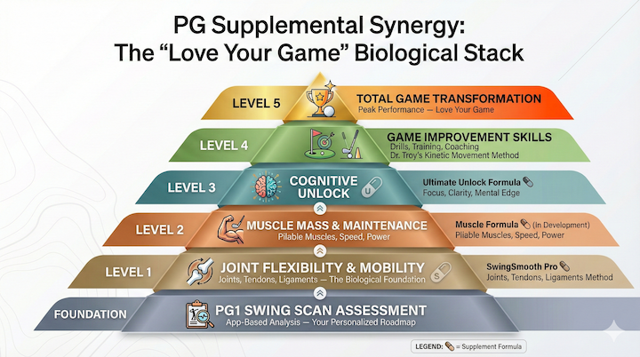

# Response to Marc: Muscle Formula Positioning

**Date:** January 16, 2026  
**From:** Donnie @ Performance Golf  
**To:** Marc Stockman  
**Re:** Distance Formula Positioning — Our Perspective

---

## Hey Marc,

I think the RFD (Rate of Force Development) framework is really interesting, and scientifically, it makes sense. The three-pillar approach — accelerate the signal, sustain the force, remove inhibitory noise — is solid mechanistically.

That said, I want to share some honest feedback on how we see this positioning from a marketing and belief standpoint. I think there's an opportunity to simplify in a way that makes the sale easier without losing the science.

---

## The Core Challenge: Logical Leaps

Here's what I keep coming back to: **golfers are already skeptical they can gain distance.**

That's the baseline belief we're fighting. Especially for seniors, there's a deep-seated doubt that their best golf is behind them. They've tried tips, training aids, lessons — and they're still losing yards every year.

So when we ask them to believe that a supplement can help them gain distance, we're already asking for a leap of faith.

**When we then add the brain-to-muscle connection — that the *signal* from brain to muscle is the key — we're asking for a second leap.** And that one is harder because:

1. It's less visceral — you can't *feel* your neural signal the way you can feel muscle soreness or stiffness
2. It's more complicated — it requires understanding neuroscience, not just biology
3. It's less intuitive — most golfers blame their swing, their equipment, or their body — not their brain

I'm not saying the science is wrong. I'm saying the *argument* is harder to make in direct response copy where we have seconds to capture belief. You know the science better than I do — I'm speaking purely from the marketing trenches here.

---

## The Simpler Path: One Villain

What I think resonates more strongly is the concept golfers already understand and believe: **muscle decline.**

They feel it. They see it. They know their muscles aren't what they used to be. And they intuitively connect that to lost distance.

Instead of three pillars, what if we positioned around **one primary villain** — the biological mechanism that accelerates muscle deterioration beyond normal aging?

There may be a specific biological term for this — I'd defer to you on the naming — but the concept is one clear enemy rather than three abstract pillars. Whether that's oxidative stress, inflammatory markers, or something else you've identified in your research — give them ONE enemy to defeat.

The three-pillar RFD science can still work in the background as the *mechanism* of how the formula works. But the *headline positioning* stays simple:

"There's one thing accelerating your muscle decline faster than age alone. When you address it, you unlock the speed and distance your body is still capable of."

This is a single belief to accept, not three.

---

## The Tom Brady Connection

This reminds me of the Tom Brady philosophy on muscle.

Brady didn't want to get big, bulky, and muscular. He wanted to maintain muscle *strength* while keeping his muscles **pliable and flexible** — so when he took a hit, his muscles would bend and mend rather than tear.

I think that's the same idea for golfers. We're not selling bodybuilding. We're selling:

• **Pliable muscles** that can stretch and generate whip in the swing
• **Maintained muscle mass** that preserves speed and power
• **Flexible strength** that withstands the force of the swing without breaking down

This is a much easier mental model than "accelerate your neural signals."

And here's the key insight: pliable, powerful muscles can only do their job if the joints they're attached to can move freely. That's why the ecosystem sequence matters...

---

## How This Fits the Ecosystem

Here's where I think the positioning gets really powerful — when we connect it to SwingSmooth Pro and the broader PG supplement ecosystem.

**SwingSmooth Pro** addresses the *joints* — flexibility, mobility, the foundation of movement. It's like building the foundation of a house.

**The Muscle Formula** addresses what comes *after* the foundation is set — the muscle structure that generates speed and force. Your joints can move freely now — but it's your muscles that generate the speed and power those joints can finally support.

The logic flows naturally:

1. First, we get your joints flexible and mobile (SwingSmooth Pro)
2. Then, we maintain and build the muscle that generates speed (Muscle Formula)
3. Finally, we optimize your cognitive function for focus and performance (Ultimate Unlock Formula)

This creates a **sequential upsell path** that makes biological sense to the customer:

"Now that your foundation is strong, let's build the house."

---

## The Full Vision: PG Supplemental Synergy

I want to share how we see this fitting into the larger Performance Golf biological transformation ecosystem. We're calling this the **"Love Your Game" Biological Stack** — a Maslow-style pyramid of total golfer transformation.

Here's the visual:

---

## The Upsell Logic

This pyramid creates a natural ascension path for the three supplement formulas:

**SwingSmooth Pro → Muscle Formula:**
"Your joints are now flexible and your foundation is strong. But it's your muscles that generate the speed and power those joints can finally support. Let's maintain and build that muscle structure."

**Muscle Formula → Ultimate Unlock:**
"Your body is optimized — joints flexible, muscles maintained. Now let's dial in your mind. Sharper focus, faster processing, the cognitive edge that lets you perform under pressure."

Each step builds logically on the last. No step feels like a random add-on.

---

## My Recommendation

Here's what I'd propose we test:

**Lead with the simple positioning:**
• One villain (muscle decline / the biological trigger accelerating it)
• One solution (the formula that addresses it)
• One outcome (maintained muscle mass → preserved speed → more distance)

**Let the three-pillar RFD science work in the background:**
• It becomes the "mechanism" section of the VSL or sales page
• "Here's WHY this formula works at the biological level..."
• But it's not the headline hook

**If the survey data shows strong resonance with the brain-to-muscle angle**, we can test that positioning too. I don't want to dismiss it entirely — I just think it's a harder sell and should probably be the B-test, not the A-test.

For the survey, I'm thinking we test belief statements like:
• "My muscles aren't as strong as they used to be"
• "My brain doesn't communicate with my muscles as well as it used to"

...and see which resonates more viscerally with our audience.

---

## Summary: Positioning Comparison

**MARC'S FRAMEWORK:**
• Three pillars (signal, force, inhibition)
• Requires understanding neuroscience
• Brain controls muscles → muscles control distance
• RFD / neural signal as headline hook
• Science is front-and-center positioning

**OUR SUGGESTED APPROACH:**
• One villain (muscle decline trigger)
• Requires understanding what they already feel
• Muscles control distance (already believed)
• "Stop the one thing accelerating decline" as hook
• Science works in background as mechanism
• Sequential upsell from SwingSmooth Pro ecosystem

---

## Next Steps

1. **Your thoughts on this direction?** I want to make sure we're aligned before we go deeper on copy angles.

2. **Survey data** — When we have results, let's see if there's signal toward either positioning. Happy to test both if the data is ambiguous.

3. **Naming** — Once we lock positioning, we can work on what to call the "villain" and the formula itself. What's the single most compelling biological trigger from your research?

4. **Timeline** — Can we sync on this by end of next week? I want to make sure we're aligned before the copy team starts drafting.

Looking forward to your thoughts, Marc. I know this is a lot, but I wanted to give you the full picture of how we're thinking about this.

— Donnie

---

*P.S. — I'm personally experiencing muscle decline for the first time in my life right now. Outside of a push-up challenge, I've just been doing yoga — no lifting, no pull-ups — and I can see my muscles getting smaller. It's real, it's visceral, and I think every golfer over 45 knows exactly what I'm talking about. That's the belief we should tap into.*
