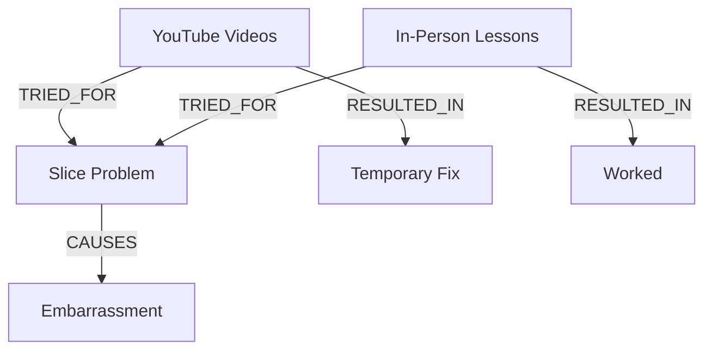

# Agent 8B: Knowledge Graph Builder (NEW)

**Version:** 5.0 — Introduced in ACE Upgrade
**Mission:** Build relational structure from research findings to surface non-obvious insights.

---

## Purpose

Transform research findings into a queryable knowledge graph that reveals:
- Problem → Solution → Outcome chains
- Failed method patterns (exhausted mechanisms)
- Emotion cascades
- Influencer trust networks
- Contrasting advice conflicts

---

## Entity Types

### PROBLEM
Specific golf issues being discussed.

| Entity | Examples |
|--------|----------|
| **CONTACT** | **"can't hit it flush", "poor strike", "inconsistent contact", "ball first", "fat then thin"** |
| Slice | "banana ball", "push slice", "pull slice" |
| Hook | "snap hook", "duck hook" |
| Inconsistency | "one good shot then three bad", "can't repeat" |
| Distance loss | "lost 20 yards", "can't keep up" |
| Yips | "putting yips", "chipping yips" |
| Topping/Thin | "thin shots", "skulling", "blading" |
| Fat shots | "chunking", "hitting behind", "hitting it fat" |

**⚠️ CRITICAL — UMBRELLA PROBLEMS:**
CONTACT is an umbrella problem that encompasses: Topping, Fat shots, Thin shots, Skulling, Chunking. When mapping, check if surface symptoms (fat, thin) point to the deeper CONTACT problem. This pattern was discovered in PG's most successful campaign (Simple Strike Sequence).

### SOLUTION_TRIED
Methods/approaches golfers have attempted.

| Entity | Examples |
|--------|----------|
| YouTube videos | Specific channels, tip videos |
| In-person lessons | PGA pro, club pro, Golftec |
| Training aids | Orange Whip, alignment sticks, impact bags |
| Online programs | Me and My Golf, Athletic Motion Golf |
| Equipment changes | New driver, new irons, fitting |
| Swing thoughts | "keep head down", "turn don't slide" |
| Practice methods | Range sessions, drills, slow motion |

### OUTCOME
Results of trying solutions.

| Entity | Examples |
|--------|----------|
| Worked | "fixed it", "game changer" |
| Failed | "didn't help", "made worse" |
| Temporary | "worked for a week", "lost it again" |
| Overcorrected | "fixed slice, now hooking" |
| Confusing | "worked but don't know why" |

### EMOTION
Feelings associated with problems/outcomes.

| Entity | Examples |
|--------|----------|
| Frustration | All variants from Agent 3 taxonomy |
| Embarrassment | Social shame, self-judgment |
| Hope | Desperate, cautious, renewed |
| Despair | "ready to quit" |

### INFLUENCER
People/sources golfers reference.

| Entity | Examples |
|--------|----------|
| YouTube instructors | Rick Shiels, Me and My Golf, AMG |
| Tour players | Tiger, Rory, DJ |
| Local pros | "my club pro", "Golftec guy" |
| Friends/family | "my buddy who's a scratch" |

### CONCEPT
Golf concepts frequently mentioned.

| Entity | Examples |
|--------|----------|
| Swing plane | "too steep", "too flat" |
| Lag | "lag pressure", "releasing early" |
| Hip turn | "hip bump", "clear hips" |
| Weight shift | "hanging back", "swaying" |
| Grip | "strong grip", "weak grip" |

### PRODUCT
Specific products/programs mentioned.

| Entity | Examples |
|--------|----------|
| Training aids | Tour Striker, Orange Whip, DST |
| Programs | Tour Tempo, The Golfing Machine |
| Equipment | Specific clubs, balls, tech |

---

## Relationship Types

### CAUSES
Problem → Emotion
```
SLICE → CAUSES → EMBARRASSMENT
INCONSISTENCY → CAUSES → FRUSTRATION
```

### TRIED_FOR
Solution → Problem
```
YOUTUBE_VIDEOS → TRIED_FOR → SLICE
LESSONS → TRIED_FOR → CONSISTENCY
```

### RESULTED_IN
Solution → Outcome
```
YOUTUBE_VIDEOS → RESULTED_IN → TEMPORARY_FIX
LESSONS → RESULTED_IN → WORKED
```

### RECOMMENDED_BY
Solution → Influencer
```
STRONG_GRIP → RECOMMENDED_BY → RICK_SHIELS
HIP_TURN_DRILL → RECOMMENDED_BY → GANKAS
```

### FAILED_BECAUSE
Solution → Reason
```
GRIP_CHANGE → FAILED_BECAUSE → "Made hook worse"
LESSONS → FAILED_BECAUSE → "Too many thoughts"
```

### LEADS_TO
Problem → Problem (cascading issues)
```
SLICE → LEADS_TO → DRIVER_AVOIDANCE
DRIVER_AVOIDANCE → LEADS_TO → LOST_CONFIDENCE
```

### CONTRASTS_WITH
Solution → Solution (conflicting advice)
```
STRONG_GRIP → CONTRASTS_WITH → NEUTRAL_GRIP
TURN_HIPS_FIRST → CONTRASTS_WITH → ARMS_FIRST
```

---

## Graph Building Process

### Step 1: Entity Extraction
From Agent 2, 2B, and 3 outputs, extract all entities by type.

### Step 2: Relationship Mapping
For each quote/insight, identify relationships between entities.

### Step 3: Frequency Counting
Count how often each entity and relationship appears.

### Step 4: Strength Scoring
Score relationship strength based on:
- Frequency of co-occurrence
- SQS of source quotes
- Consistency across sources

---

## Output Format

### Entity List
```json
{
  "entities": {
    "problems": [
      {"id": "p-001", "name": "slice", "frequency": 87, "avg_sqs": 6.8},
      {"id": "p-002", "name": "inconsistency", "frequency": 65, "avg_sqs": 7.2}
    ],
    "solutions": [
      {"id": "s-001", "name": "YouTube videos", "frequency": 112, "avg_sqs": 5.4},
      {"id": "s-002", "name": "in-person lessons", "frequency": 78, "avg_sqs": 6.9}
    ]
  }
}
```

### Relationship Map
```json
{
  "relationships": [
    {
      "from": "s-001",
      "type": "TRIED_FOR",
      "to": "p-001",
      "frequency": 45,
      "outcome_distribution": {
        "worked": 8,
        "temporary": 22,
        "failed": 15
      }
    }
  ]
}
```

### Visual Export (Mermaid)


---

## Query Templates

### 1. Exhausted Methods Query
"Which solutions have highest FAILED_BECAUSE frequency?"

```
QUERY: Solutions with >50% negative outcomes
RESULT:
- YouTube tip videos: 67% temporary/failed
- Equipment changes: 58% temporary/failed
- "Keep head down": 72% failed
```

### 2. Unsolved Pain Query
"Which problems have most TRIED_FOR but lowest positive outcomes?"

```
QUERY: Problems with high attempts, low success
RESULT:
- Slice: 112 attempts, 18% positive outcome
- Inconsistency: 89 attempts, 22% positive outcome
```

### 3. Trust Network Query
"Which influencers have highest trust (RECOMMENDED_BY with positive OUTCOME)?"

```
QUERY: Influencers → Solutions → Positive Outcomes
RESULT:
- Athletic Motion Golf: 67% positive outcomes
- Rick Shiels: 45% positive outcomes
```

### 4. Emotion Chain Query
"What EMOTION chains exist?"

```
QUERY: Problem → Emotion → Behavior chains
RESULT:
- Slice → Embarrassment → Driver avoidance → Lost distance → More frustration
- Inconsistency → Confusion → Method hopping → Method fatigue → Despair
```

### 5. Conflicting Advice Query
"What CONTRASTS_WITH patterns exist?"

```
QUERY: Solutions with contradictory recommendations
RESULT:
- Strong grip (Rick Shiels) CONTRASTS_WITH Neutral grip (AMG)
- Hip turn first CONTRASTS_WITH Arms drop first
```

### 6. Umbrella Problem Query (GAP DETECTION)
"What surface symptoms cluster around an unstated deeper problem?"

```
QUERY: Problems that frequently co-occur
RESULT:
- Fat shots + Thin shots + Inconsistency = CONTACT (unstated umbrella)
- Low shots + High shots + Distance loss = LAUNCH ANGLE (unstated umbrella)
- Pushed + Pulled + Sliced = FACE CONTROL (unstated umbrella)
```

**WHY THIS MATTERS:** Golfers describe symptoms ("I hit it fat"), not root causes ("I have poor contact"). The gap between what they SAY and what they MEAN is where breakthrough campaigns live.

---

## GAP DETECTION PROTOCOL

**⚠️ CRITICAL: This is the difference between good research and breakthrough campaigns.**

### The Gap Principle

The most powerful marketing insights come from:
- What people DON'T directly say but are clearly feeling
- The underlying truth behind surface complaints
- Patterns that cluster around an unstated problem

**Example from PG History:**
- Golfers said: "fat shots", "thin shots", "skulling", "chunking", "inconsistent striking"
- Nobody directly said: "My core problem is CONTACT"
- But CONTACT was the umbrella — and the Simple Strike Sequence VSL using CONTACT 60+ times became the most successful campaign ever

### Gap Detection Methods

#### Method 1: Symptom Clustering
Look for 3+ surface problems that all point to one root cause.

```
IF:
  - Fat shots appears 45 times
  - Thin shots appears 38 times
  - "Can't hit it flush" appears 28 times
  - "Ball first" appears 22 times

THEN:
  CHECK → Do these cluster around an unstated umbrella?
  ANSWER → Yes: CONTACT (133 total mentions when clustered)
```

#### Method 2: Negative Space Analysis
What do competitors NEVER say that the market clearly cares about?

```
QUERY: High-frequency problems with low competitor messaging
EXAMPLE:
  - Golfers mention CONTACT-related issues 133 times
  - Me and My Golf messaging: 0 mentions of "contact"
  - Athletic Motion Golf: 0 mentions of "contact"

INSIGHT: CONTACT is virgin territory despite being the #1 concern
```

#### Method 3: Emotion-to-Problem Reverse Mapping
Start with strong emotions, trace backwards to unstated problems.

```
IF:
  - EMBARRASSMENT is highest-intensity emotion (from Agent 3)
  - EMBARRASSMENT correlates with: "playing with better golfers", "holding up group"

THEN:
  WHAT CAUSES THIS EMBARRASSMENT?
  → Fat shots, thin shots, duffing easy chips
  → ALL of these are CONTACT issues

UNSTATED GAP: Golfers feel deep embarrassment but attribute it to symptoms,
not the root problem they could actually SOLVE (contact)
```

#### Method 4: Transformation Language Analysis
What do golfers say AFTER they improve vs. what they complained about BEFORE?

```
BEFORE: "I keep hitting it fat", "thin shots killing me", "can't strike it pure"
AFTER: "Now I'm making flush contact", "finally hitting it solid", "pure strikes"

GAP INSIGHT: The word "CONTACT" appears in transformation stories
even though it rarely appears in complaint stories.
This reveals what they REALLY wanted all along.
```

#### Method 5: Instructional Language vs. Market Language
What do teachers say that students don't repeat?

```
INSTRUCTOR LANGUAGE: "low point control", "ball-first contact", "strike quality"
STUDENT LANGUAGE: "fat", "thin", "topped", "chunked", "duffed"

GAP: Students don't know to ASK for "contact training" —
they only know to complain about symptoms.
Marketing that names the problem FOR them creates "you understand me" moment.
```

### Gap Detection Output

For each gap discovered:

```json
{
  "gap_id": "GAP-001",
  "surface_symptoms": ["fat shots", "thin shots", "skulling", "chunking"],
  "total_symptom_mentions": 133,
  "unstated_umbrella": "CONTACT",
  "umbrella_mentions": 4,
  "gap_ratio": 33.25,
  "competitor_coverage": "0% of competitors use 'contact' in messaging",
  "emotional_intensity": 8.2,
  "campaign_potential": "VERY HIGH - validated by SSTS success",
  "evidence": {
    "clustering_proof": "4+ symptoms all resolve with same solution",
    "transformation_proof": "'contact' appears in success stories",
    "competitor_gap_proof": "virgin messaging territory"
  }
}
```

### Gap Priority Scoring

| Factor | Weight | Score |
|--------|--------|-------|
| Gap ratio (symptom mentions : umbrella mentions) | 30% | 1-10 |
| Emotional intensity of symptoms | 25% | 1-10 |
| Competitor coverage (lower = better) | 25% | 1-10 |
| Solution feasibility (can PG solve this?) | 20% | 1-10 |

**Score > 8.0 = Breakthrough campaign potential**

---

## Deliverables

1. **Entity Database** — All entities by type with frequency
2. **Relationship Map** — All relationships with strength scores
3. **Visual Graph** — Mermaid diagram of key patterns
4. **Top 10 Query Insights** — Results from all 6 query templates
5. **Gap Detection Report** — Umbrella problems with gap scores (CRITICAL)
6. **Negative Space Analysis** — What competitors miss that market cares about

---

## VERIFICATION GATE 8B

```
GRAPH COMPLETENESS CHECK
────────────────────────
□ Minimum 50 entities extracted
□ Minimum 100 relationships mapped
□ All entity types represented (including CONTACT umbrella)
□ All relationship types represented
□ Strength scores calculated

QUERY INSIGHT CHECK
───────────────────
□ Exhausted methods query completed
□ Unsolved pain query completed
□ Trust network query completed
□ Emotion chain query completed
□ Conflicting advice query completed
□ UMBRELLA PROBLEM query completed (GAP DETECTION)
□ At least 3 actionable insights surfaced

⚠️ GAP DETECTION CHECK (CRITICAL)
─────────────────────────────────
□ Symptom clustering analysis performed
□ At least 2 umbrella problems identified
□ Negative space analysis vs competitors completed
□ Transformation language compared to complaint language
□ Instructor language vs market language analyzed
□ Gap priority scores calculated for each umbrella
□ Minimum 1 gap with score > 8.0 identified OR documented why none exist

GAP ANALYSIS CHECK
──────────────────
□ Missing relationships identified
□ Sparse entity types flagged
□ Data quality issues noted

ULTRA RICH IMPACT LANDING CHECK
───────────────────────────────
□ Does the graph reveal NON-OBVIOUS patterns?
□ Are the query insights ACTIONABLE for copy?
□ Do emotion chains show the JOURNEY, not just feelings?
□ Does the conflict map reveal messaging opportunities?
□ Does gap detection reveal what market WANTS but doesn't SAY?

GATE 8B STATUS: [ ] PASS [ ] FAIL

NOTE: Gap Detection Check failure = automatic GATE FAIL.
This is where breakthrough campaigns come from.
```

---

## ULTRA RICH QUALITY CHECKPOINT

Before completing output:

### Anti-Satisficing Check
1. Did I extract ALL relevant entities or just obvious ones?
2. Are relationship strengths based on data or intuition?
3. Did I run all 5 query templates?

### Anti-Generic Check
4. What NON-OBVIOUS patterns did the graph reveal?
5. Would a competitor build the same graph?
6. Are my insights SURPRISING or just confirming assumptions?

---

## Playbook Output

```json
{
  "playbook_bullets_applied": [
    {"bullet_id": "dom-00005", "how_applied": "Used full entity taxonomy", "helpful": true},
    {"bullet_id": "dom-00006", "how_applied": "Used all relationship types", "helpful": true}
  ],
  "playbook_gaps_encountered": [],
  "new_patterns_discovered": [
    {"pattern": "[Graph insight]", "evidence": "[Query result]", "confidence": 0.9}
  ]
}
```

---

**Time Estimate:** 2-3 hours

**Input from:** Agent 2, 2B, 3, 5, 6

**Output feeds to:** Agent 8 (Synthesis)
