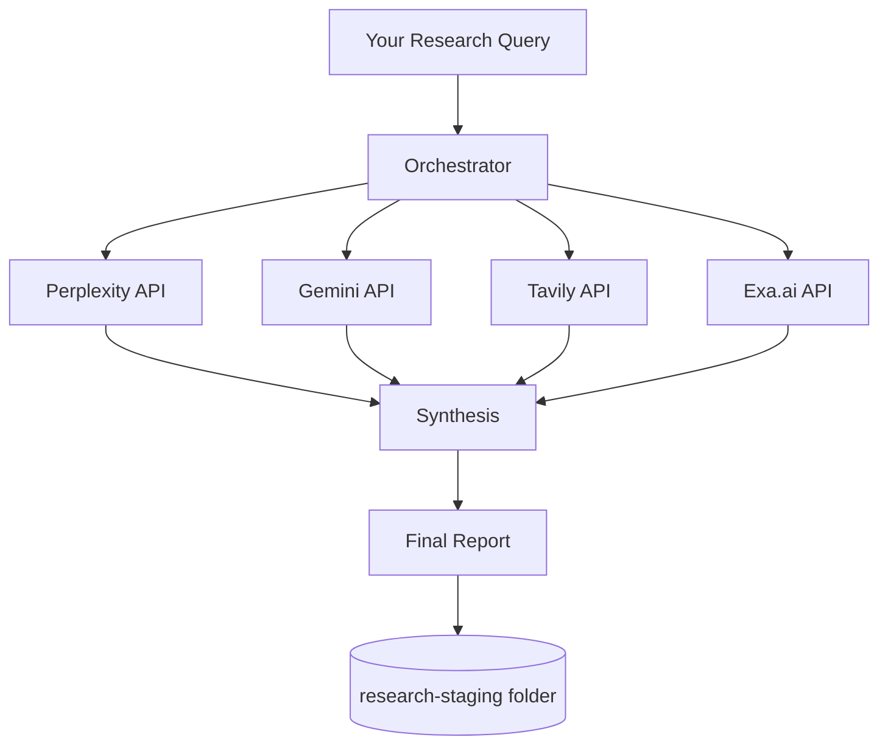
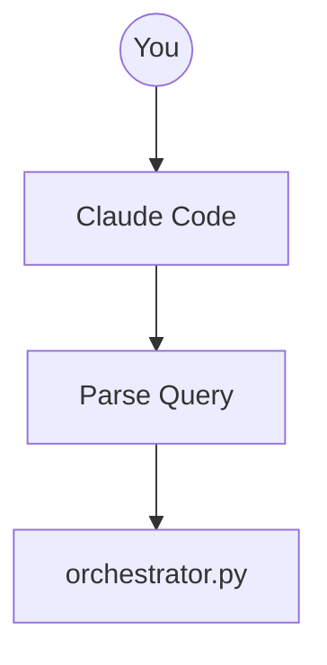
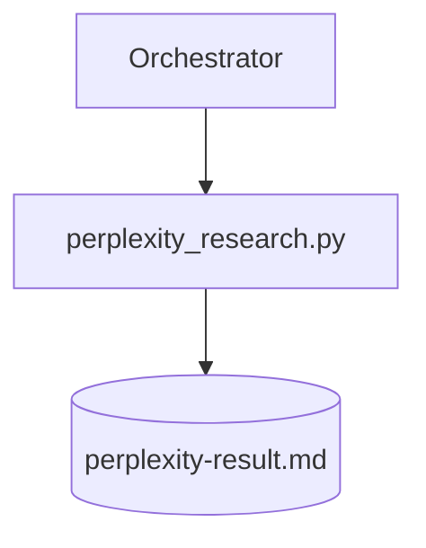
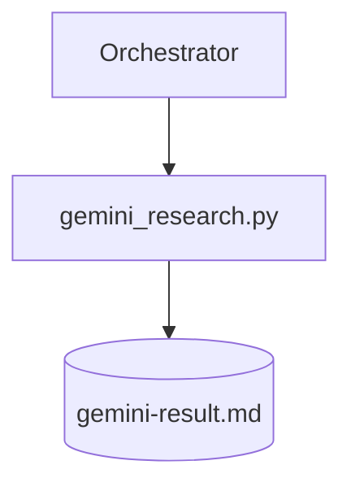
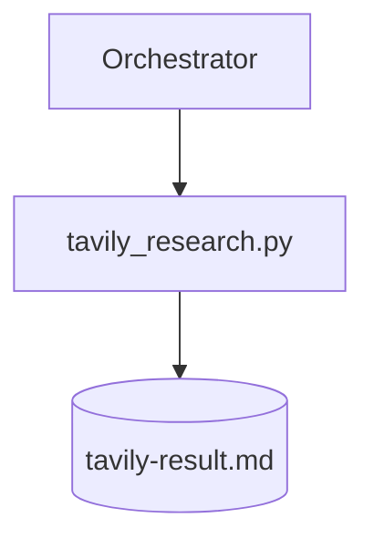
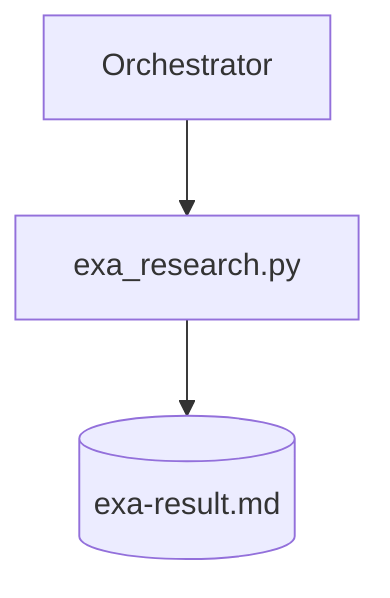
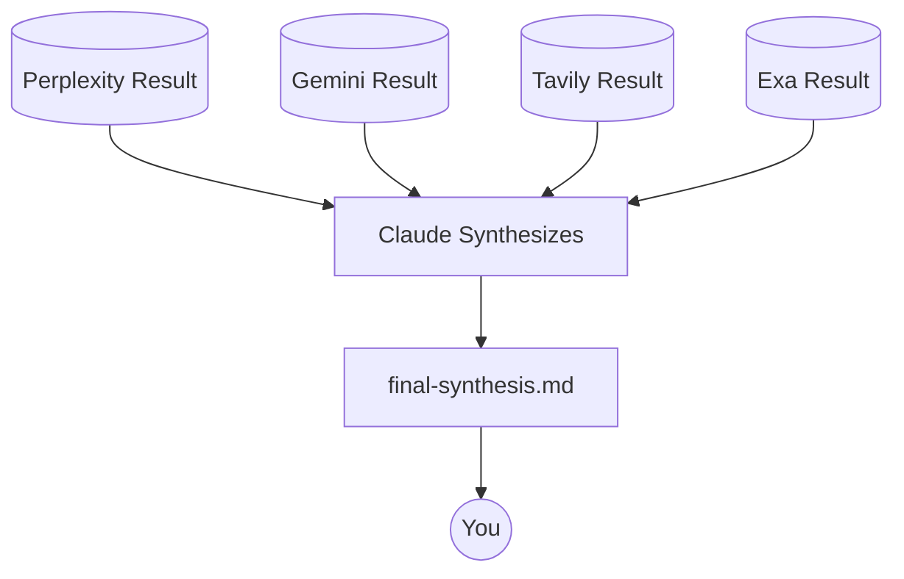
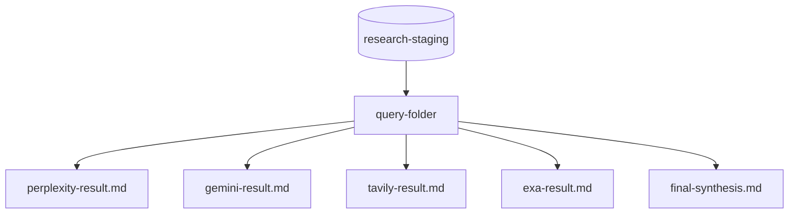
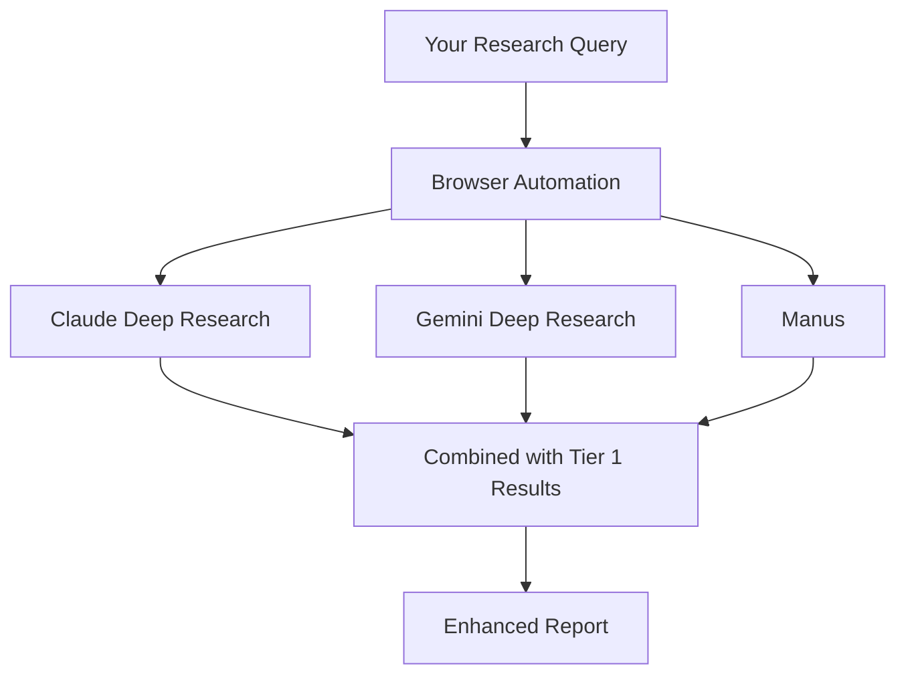
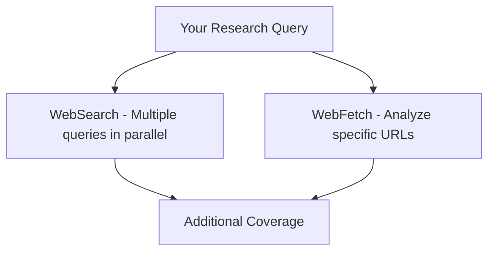

# How Deep Research Works

> **Note:** This document contains Mermaid diagrams. For best results, view in Obsidian, VS Code, or GitHub.

## Overview

The Deep Research skill runs parallel queries across 4 AI research APIs, then synthesizes the results into a comprehensive report.

## Detailed Flow

### Step 1: Query Input

### Step 2: Parallel API Calls

Each API runs independently and saves its own result file:

### Step 3: Synthesis

## Output Structure

## Why Parallel?

Running all 4 APIs simultaneously means:
- **Faster results** - Don't wait for each to finish
- **Diverse perspectives** - Each API has different strengths
- **Redundancy** - If one fails, you still get 3 results

---

## Tier 2: Browser Deep Research (Optional)

For topics needing more depth, browser automation sources provide 5-15 minute deep research via the Claude in Chrome MCP server.

These platforms perform multi-step research autonomously, producing much more thorough results than API calls. See `references/browser-automation.md` for setup instructions.

---

## Tier 3: Native Claude Tools (Always Available)

These require no setup and complement the API and browser sources:

---

*Generated for Deep Research Skill documentation*
