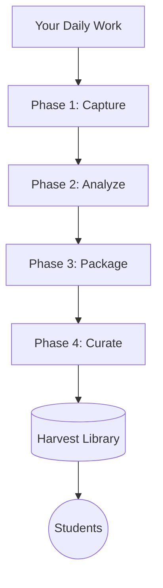
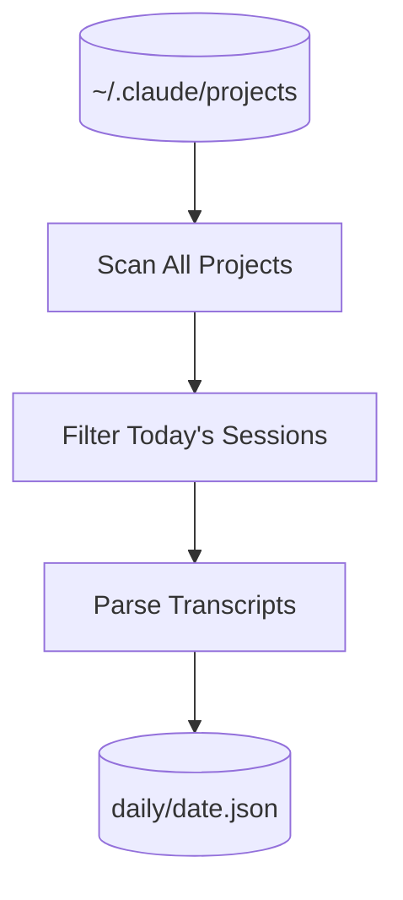
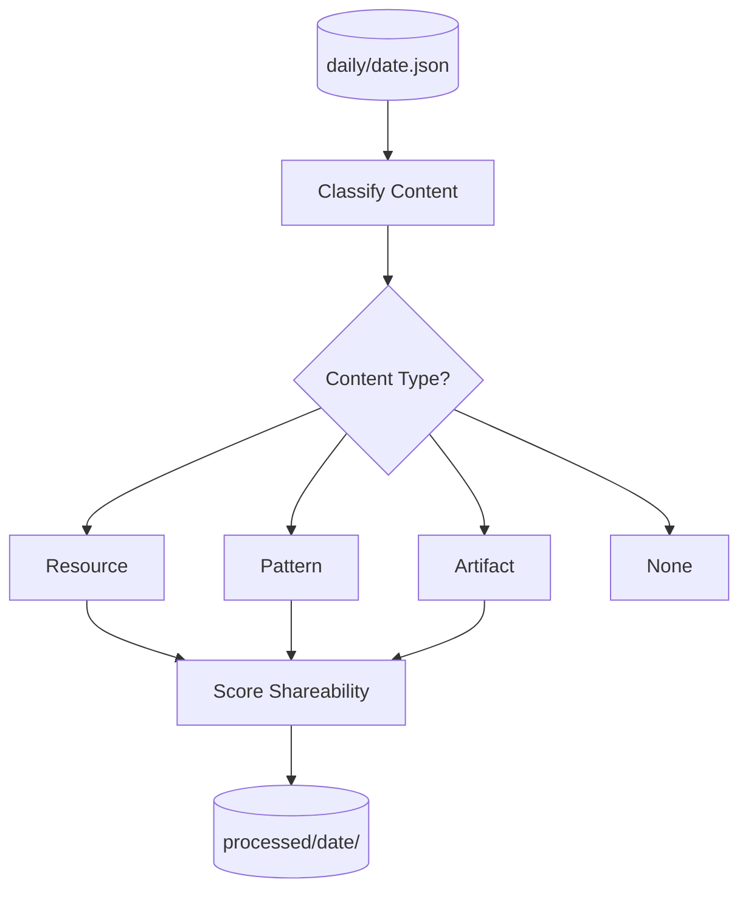
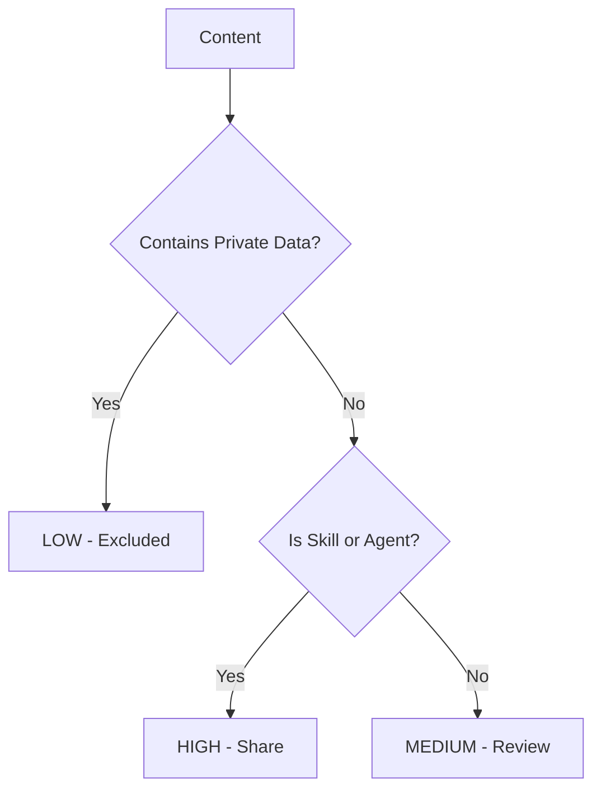
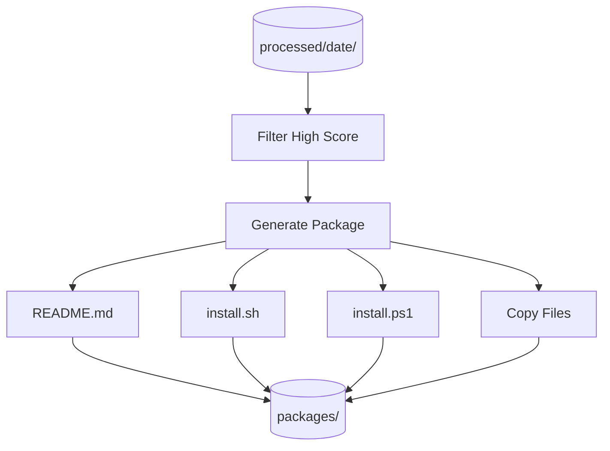
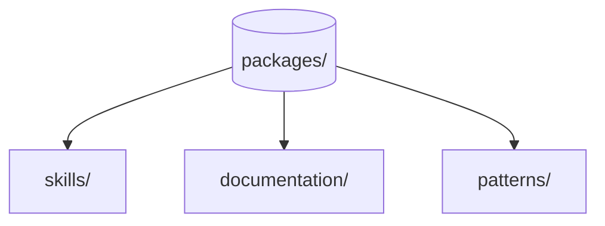
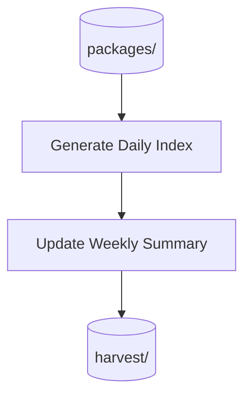
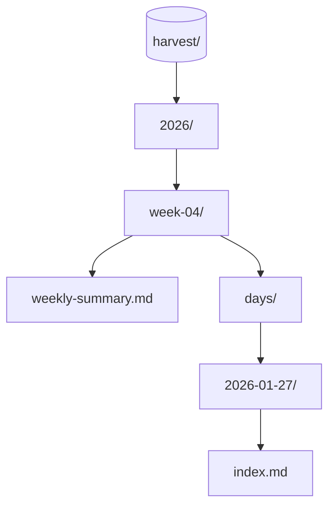
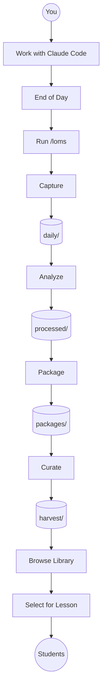
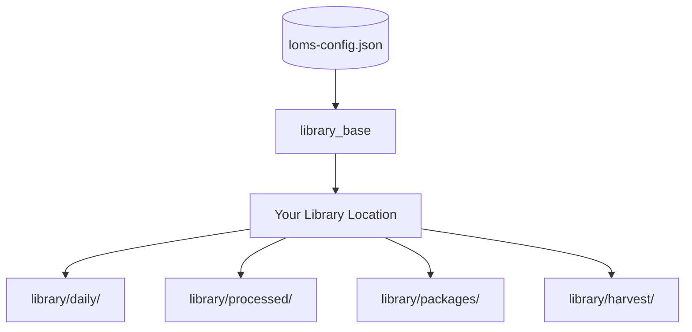

# How LOMS Works

> **Note:** This document contains Mermaid diagrams. For best results, view in Obsidian, VS Code, or GitHub.

## Overview

LOMS (Look Over My Shoulder) is a 4-phase pipeline that automatically harvests your Claude Code work into shareable student resources.

## Phase 1: Capture

Scans all your Claude Code projects and extracts today's sessions.

**What Gets Captured:**
- Project names
- Session counts
- First prompts
- Files modified
- Duration

## Phase 2: Analyze

Classifies each session by type and shareability.

**Shareability Scoring:**

## Phase 3: Package

Creates distributable packages for high-shareability items.

**Package Types:**

## Phase 4: Curate

Organizes packages into a browsable library by week.

**Library Structure:**

## Complete Pipeline

## File Output Summary

| Phase | Input | Output |
|-------|-------|--------|
| Capture | ~/.claude/projects/ | library/daily/date.json |
| Analyze | daily/date.json | library/processed/date/ |
| Package | processed/date/ | library/packages/ |
| Curate | packages/ | library/harvest/ |

## Configuration

All paths read from `~/.claude/skills/loms-config.json`:

---

*Generated for LOMS System documentation*
