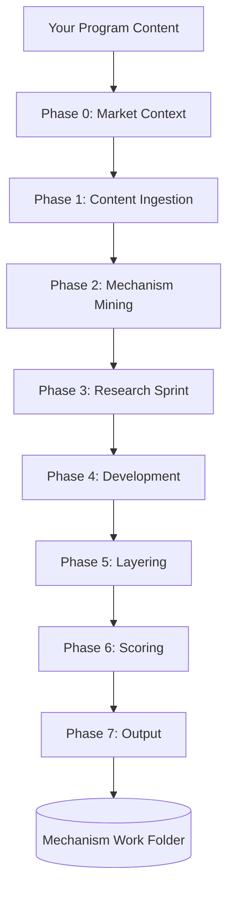
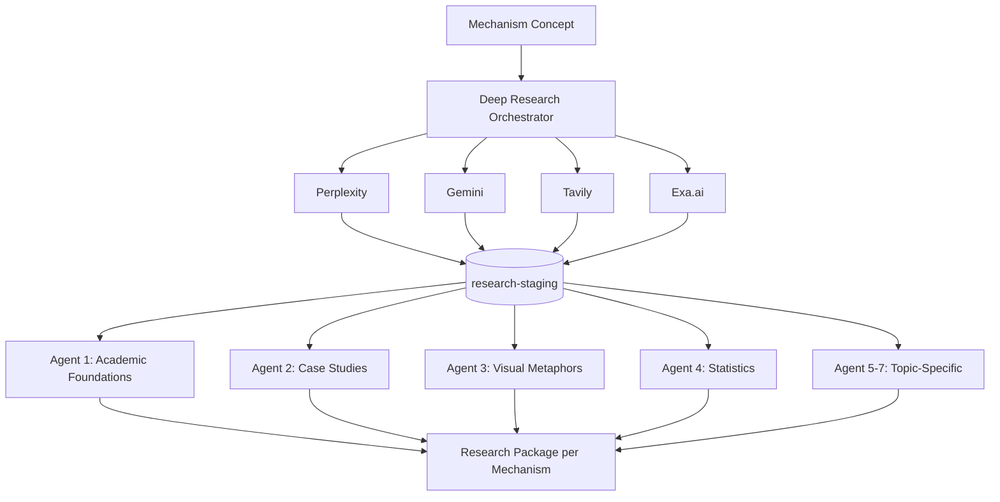
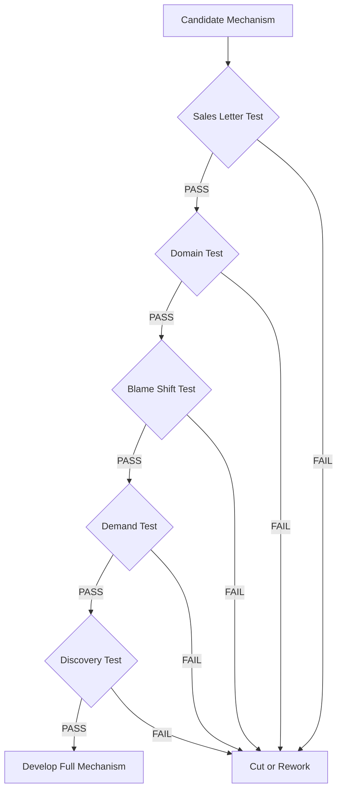
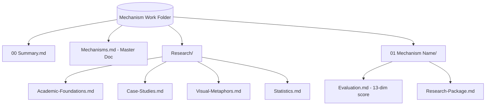

# How the Mechanism Ideator Works

> **Note:** This document contains Mermaid diagrams. For best results, view in Obsidian, VS Code, or GitHub.

## Overview

The Mechanism Ideator runs an 8-phase process to transform program content into copy-ready marketing mechanisms.

## Phase 3: Research Sprint (Where Deep Research Fits)

This is where the Deep Research skill integrates. For each mechanism concept, the orchestrator runs all 4 API sources in parallel:

## What Makes a Good Mechanism

Every mechanism must pass 5 tests before development:

## Output Structure

---

*Generated for Mechanism Ideator documentation*
