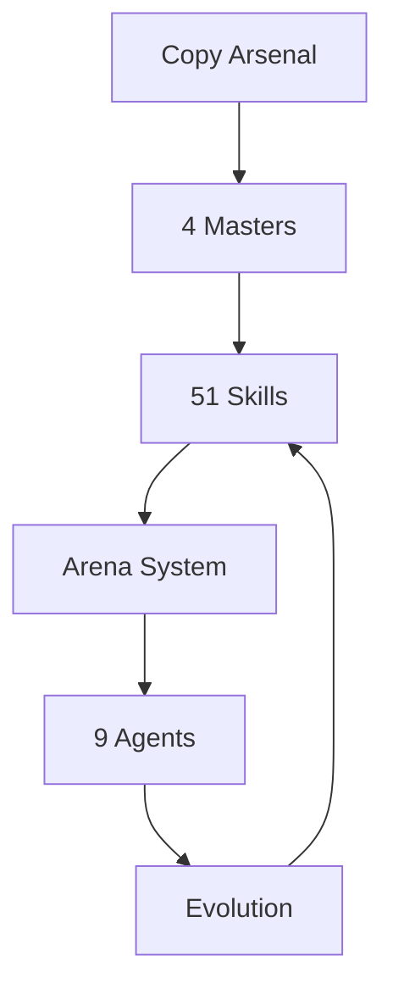
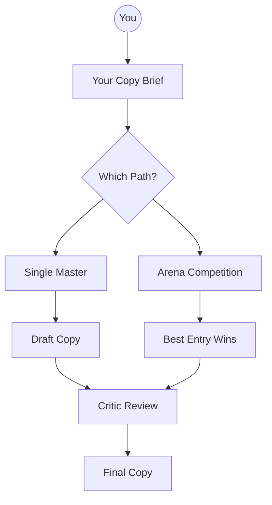

# ZenithPro Copy Arsenal - Diagram Index

Visual documentation for the ZenithPro Copy Arsenal system. All diagrams render natively in Obsidian.

---

## Available Diagrams

| # | Diagram | Purpose |
|---|---------|---------|
| 01 | [[01-System-Architecture]] | Complete system overview |
| 02 | [[02-Four-Masters-Overview]] | The 4 copywriting masters |
| 03 | [[03-Clayton-Skills]] | Clayton Makepeace skill map |
| 04 | [[04-Deutsch-Skills]] | David Deutsch skill map |
| 05 | [[05-Evaldo-Skills]] | Evaldo Albuquerque skill map |
| 06 | [[06-Carlton-Skills]] | John Carlton skill map |
| 07 | [[07-Arena-System]] | Competitive evolution engine |
| 08 | [[08-Arena-Competition-Flow]] | How Arena runs work |
| 09 | [[09-Agents-Overview]] | The 9 Arena agents |
| 10 | [[10-Evolution-System]] | How skills improve over time |
| 11 | [[11-Workflow-Selection]] | Which tool for which job |

---

## System at a Glance

---

## What You Have

---

## Quick Stats

| Component | Count |
|-----------|-------|
| Master Copywriters | 4 |
| Total Skills | 51 |
| Total Frameworks | 882+ |
| Arena Agents | 9 |
| Critics | 4 |

---

*ZenithPro Copy Arsenal v1.0*
