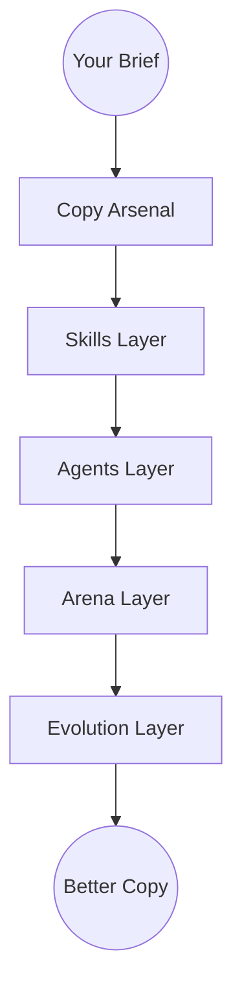
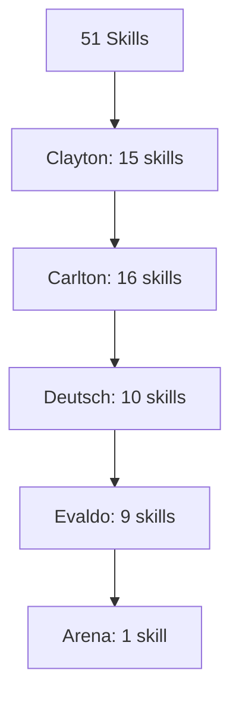
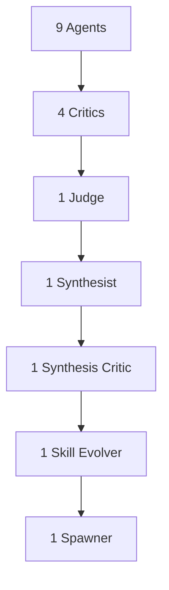
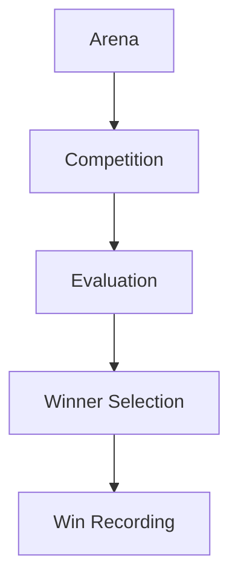
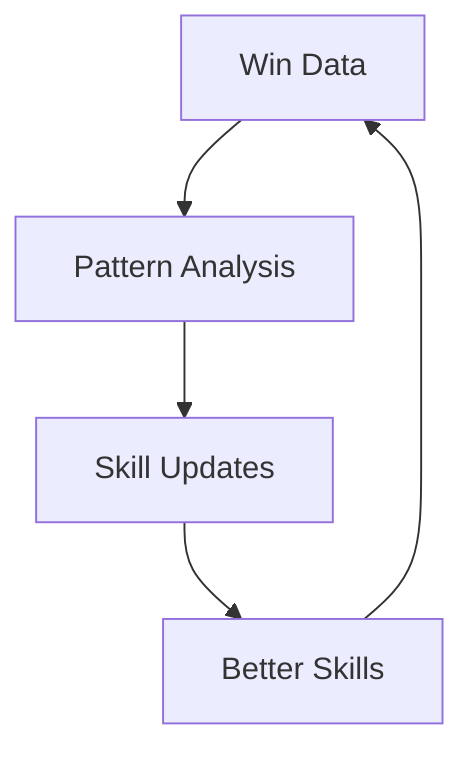
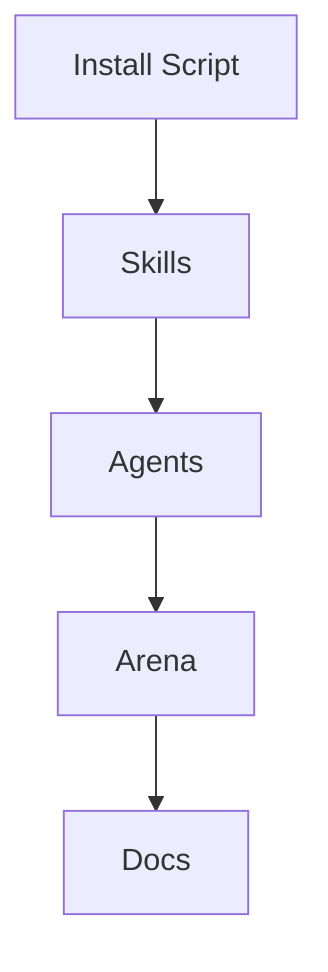
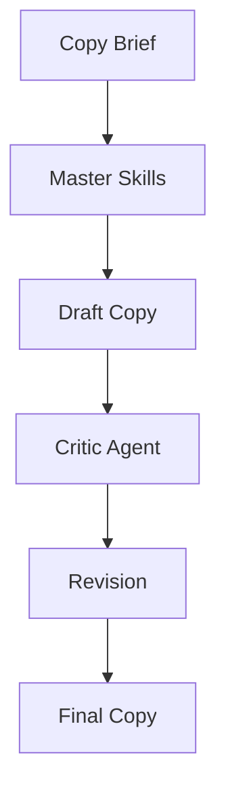

# ZenithPro Copy Arsenal - System Architecture

## Complete System Overview

---

## The Four Layers

### Layer 1: Skills (51 Total)

---

### Layer 2: Agents (9 Total)

---

### Layer 3: Arena System

---

### Layer 4: Evolution

---

## Installation Locations

| Component | Location |
|-----------|----------|
| Skills | ~/.claude/skills/ |
| Agents | ~/.claude/agents/ |
| Arena | ~/.claude/arena/ |
| Docs | ~/.claude/docs/copy-arsenal/ |

---

## Data Flow

---

*Part of the ZenithPro Copy Arsenal Diagram Set*
