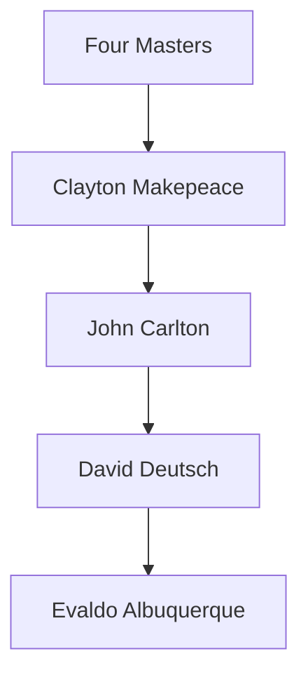
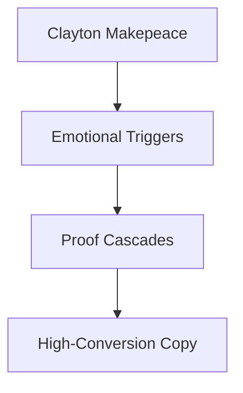
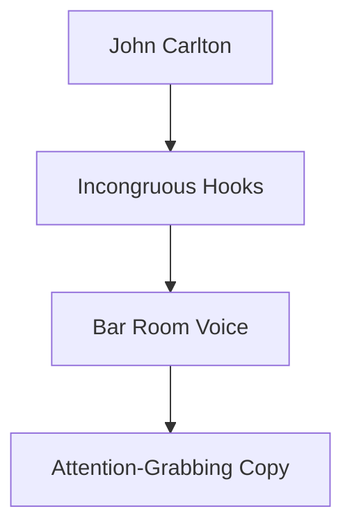
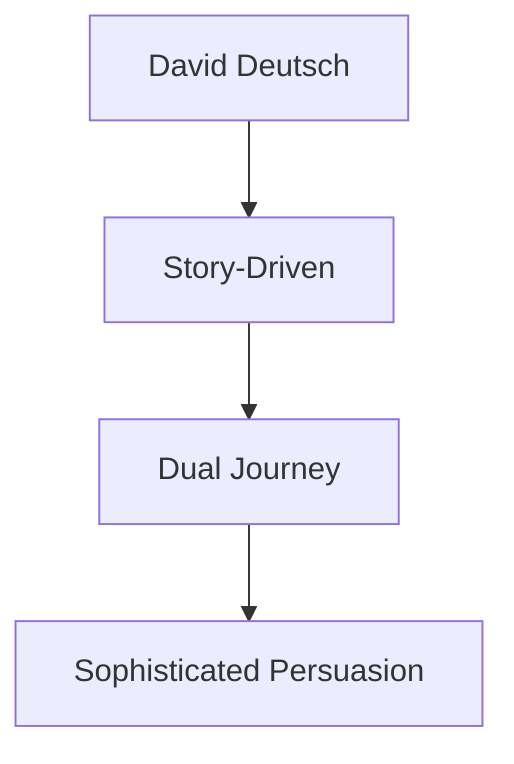
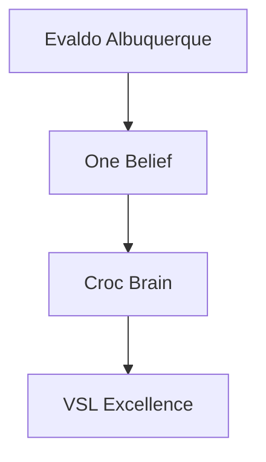

# ZenithPro Copy Arsenal - The Four Masters

## The Four Copywriting Masters

---

## Clayton Makepeace

**514 Frameworks | 15 Skills**

**Strength:** Emotional intensity that compels action

**Best For:** Health, financial, and supplement markets

---

## John Carlton

**200+ Frameworks | 16 Skills**

**Strength:** Stopping power that grabs and holds attention

**Best For:** Bold offers, personality-driven brands

---

## David Deutsch

**102 Frameworks | 10 Skills**

**Strength:** Elegant persuasion for educated buyers

**Best For:** High-end offers, educated audiences

---

## Evaldo Albuquerque

**66 Frameworks | 9 Skills**

**Strength:** VSL structure that bypasses resistance

**Best For:** Video sales letters, webinar scripts

---

## Framework Comparison

| Master | Frameworks | Skills | Specialty |
|--------|------------|--------|-----------|
| Clayton | 514 | 15 | Emotional triggers |
| Carlton | 200+ | 16 | Hooks and stopping power |
| Deutsch | 102 | 10 | Story and sophistication |
| Evaldo | 66 | 9 | VSL and croc brain |

---

## Master Selection Guide

**Selling supplements or health?**
Use Clayton - emotional proof stacking

**Need attention-grabbing hooks?**
Use Carlton - incongruous juxtaposition

**Sophisticated educated audience?**
Use Deutsch - story-driven elegance

**Creating a VSL?**
Use Evaldo - croc brain activation

---

*Part of the ZenithPro Copy Arsenal Diagram Set*
