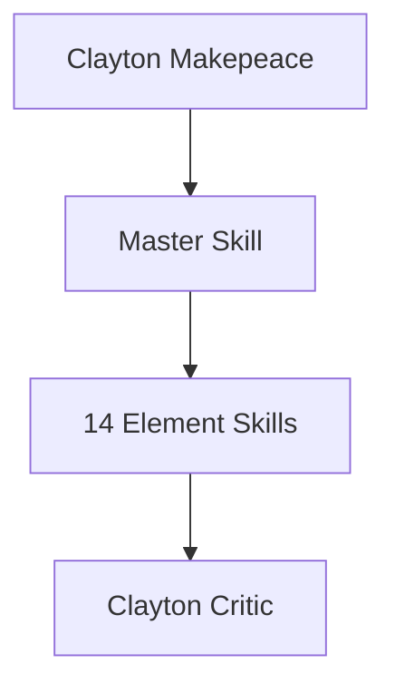
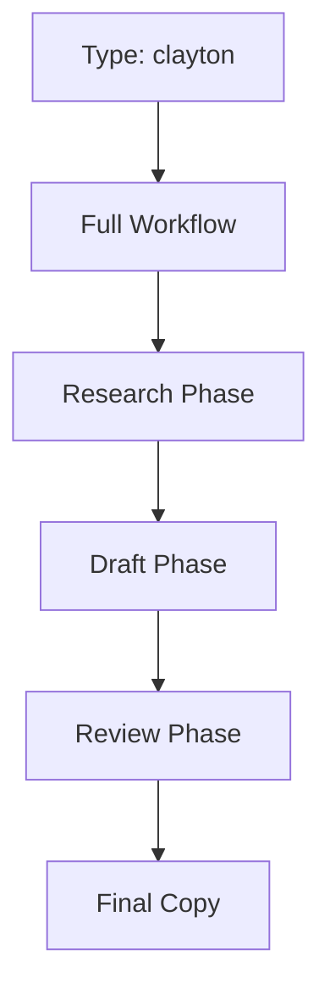
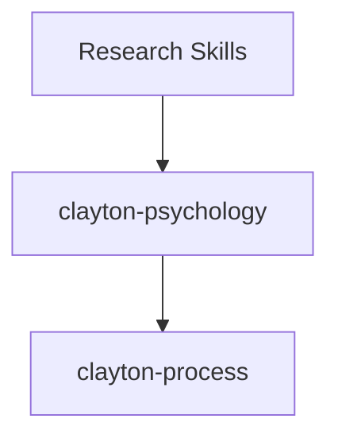
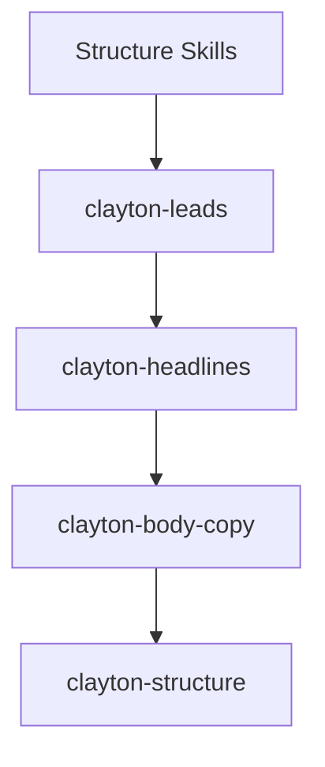
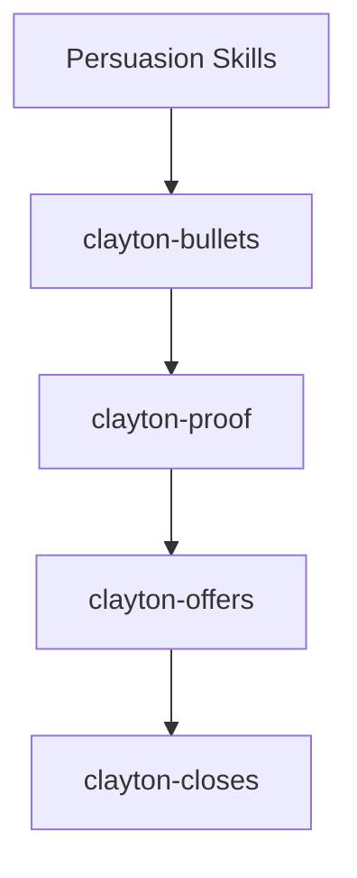
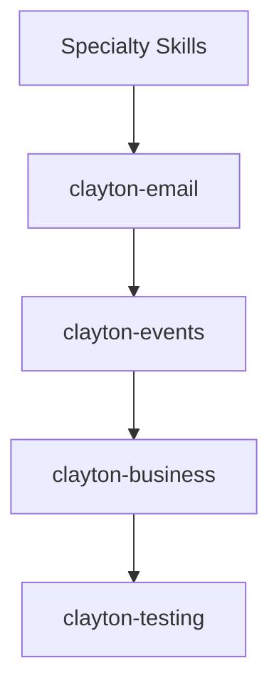
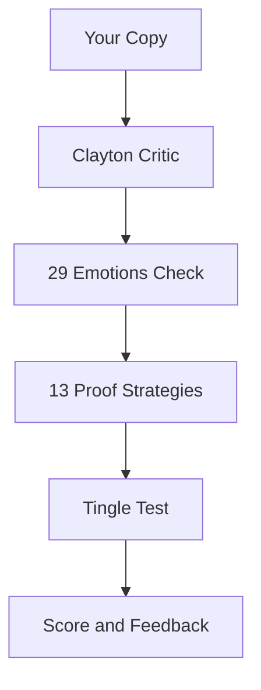

# ZenithPro Copy Arsenal - Clayton Makepeace Skills

## Clayton System Overview

**514 Frameworks | 15 Skills**

---

## Master Orchestrator

**Use when:** Complete sales letter from scratch

---

## Element Skills - Research

| Skill | Frameworks | Purpose |
|-------|------------|---------|
| clayton-psychology | 29 emotions | Emotional triggers |
| clayton-process | Research system | Discovery method |

---

## Element Skills - Structure

| Skill | Purpose |
|-------|---------|
| clayton-leads | Opening strategies |
| clayton-headlines | 24 lead strategies |
| clayton-body-copy | Body writing |
| clayton-structure | 11 components |

---

## Element Skills - Persuasion

| Skill | Purpose |
|-------|---------|
| clayton-bullets | Fascination writing |
| clayton-proof | 13 proof strategies |
| clayton-offers | Offer construction |
| clayton-closes | 10-step close |

---

## Element Skills - Specialty

| Skill | Purpose |
|-------|---------|
| clayton-email | Email campaigns |
| clayton-events | Event copy |
| clayton-business | Business of copy |
| clayton-testing | Split testing |

---

## Clayton Critic Agent

**What it evaluates:**
- 29 emotional triggers coverage
- 13 proof strategies usage
- Tingle Test compliance
- 6 headline maxims

---

## Quick Reference

| Need | Use Skill |
|------|-----------|
| Full sales letter | clayton |
| Just headlines | clayton-headlines |
| Just bullets | clayton-bullets |
| Proof elements | clayton-proof |
| Close section | clayton-closes |
| Email sequence | clayton-email |

---

*Part of the ZenithPro Copy Arsenal Diagram Set*
