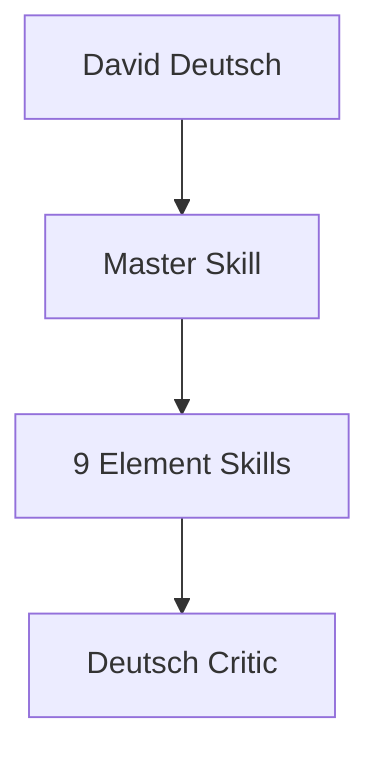
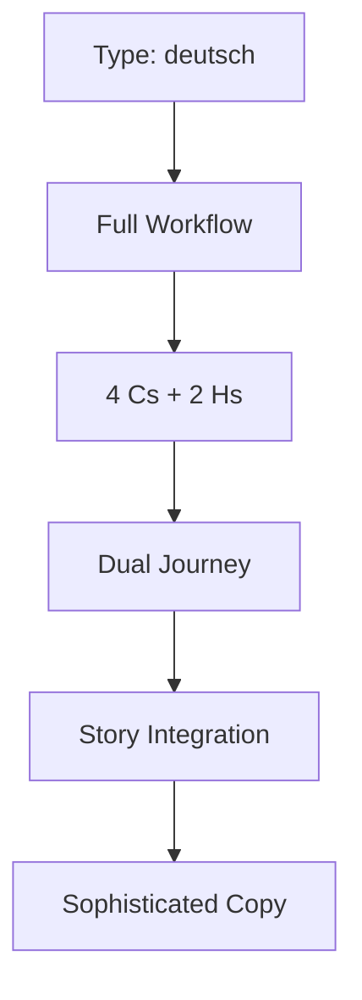
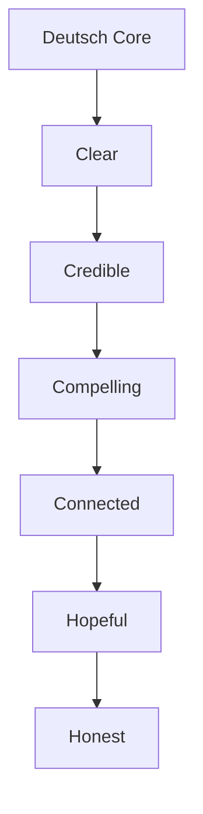
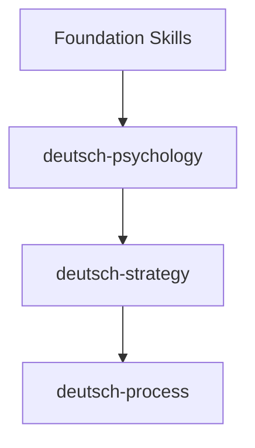
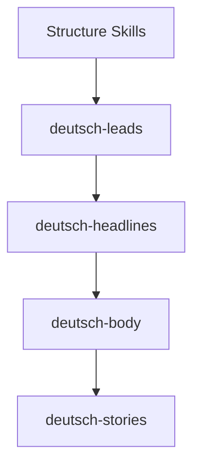
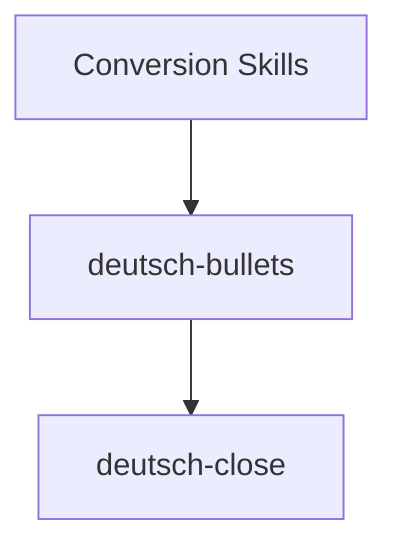
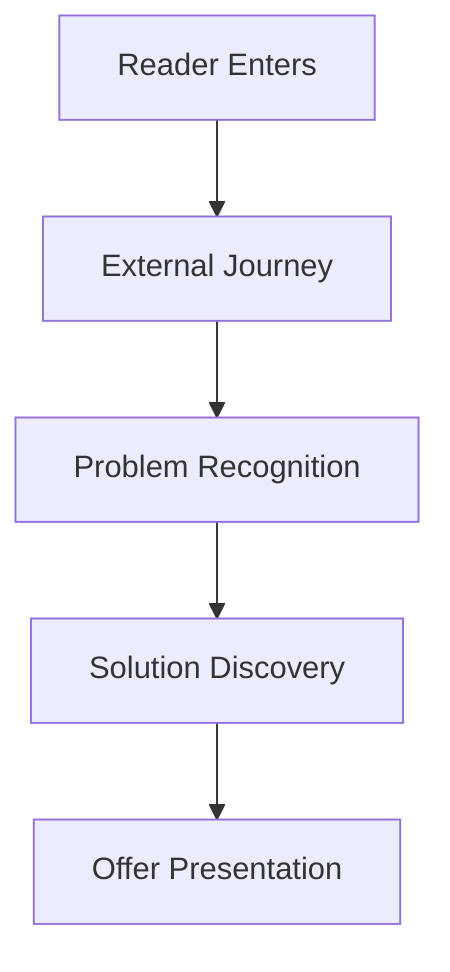
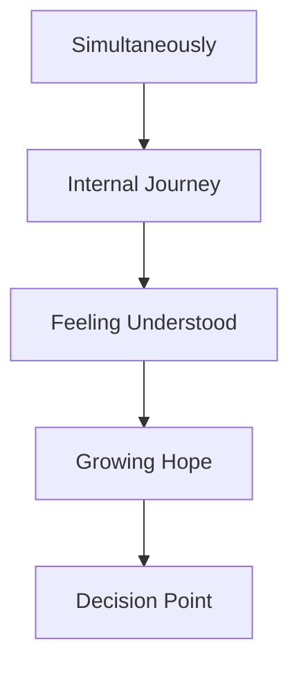
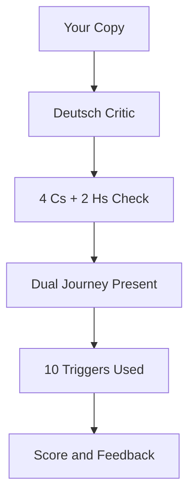

# ZenithPro Copy Arsenal - David Deutsch Skills

## Deutsch System Overview

**102 Frameworks | 10 Skills**

---

## Master Orchestrator

**Use when:** High-end offers for educated buyers

---

## The 4 Cs + 2 Hs

Every piece of copy must pass all 6 tests.

---

## Element Skills - Foundation

| Skill | Frameworks | Purpose |
|-------|------------|---------|
| deutsch-psychology | 10 triggers | Emotional foundation |
| deutsch-strategy | Market analysis | Positioning |
| deutsch-process | Just Talk method | Writing process |

---

## Element Skills - Structure

| Skill | Purpose |
|-------|---------|
| deutsch-leads | Dual journey openings |
| deutsch-headlines | Sophisticated hooks |
| deutsch-body | Energy audit writing |
| deutsch-stories | Story integration |

---

## Element Skills - Conversion

| Skill | Purpose |
|-------|---------|
| deutsch-bullets | Curiosity mechanics |
| deutsch-close | Price minimization |

---

## The Dual Journey

---

## Deutsch Critic Agent

**What it evaluates:**
- 4 Cs + 2 Hs compliance
- Dual Journey structure
- 10 Emotional Triggers
- Just Talk authenticity

---

## Quick Reference

| Need | Use Skill |
|------|-----------|
| Full sales letter | deutsch |
| Lead section | deutsch-leads |
| Headlines | deutsch-headlines |
| Story elements | deutsch-stories |
| Bullets | deutsch-bullets |
| Close section | deutsch-close |

---

*Part of the ZenithPro Copy Arsenal Diagram Set*
