# ZenithPro Copy Arsenal - Evaldo Albuquerque Skills

## Evaldo System Overview

**66 Frameworks | 9 Skills**

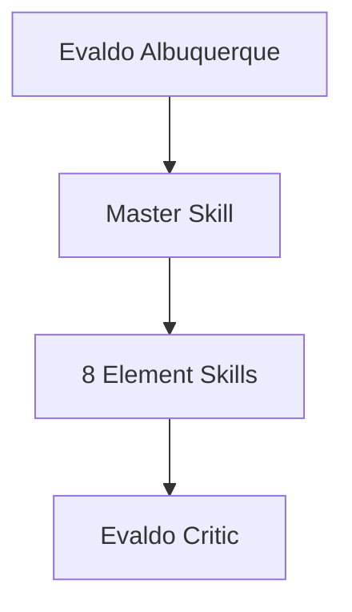

---

## Master Orchestrator

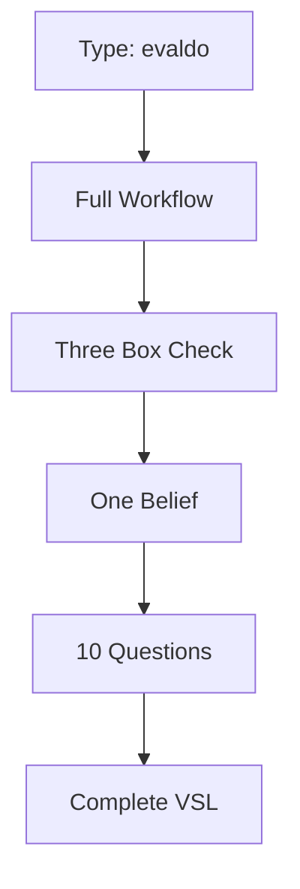

**Use when:** Creating VSLs or video scripts

---

## The One Belief Formula

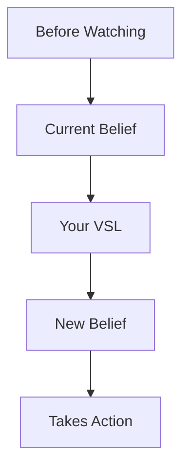

Your VSL must shift ONE core belief.

---

## The Three Box Check

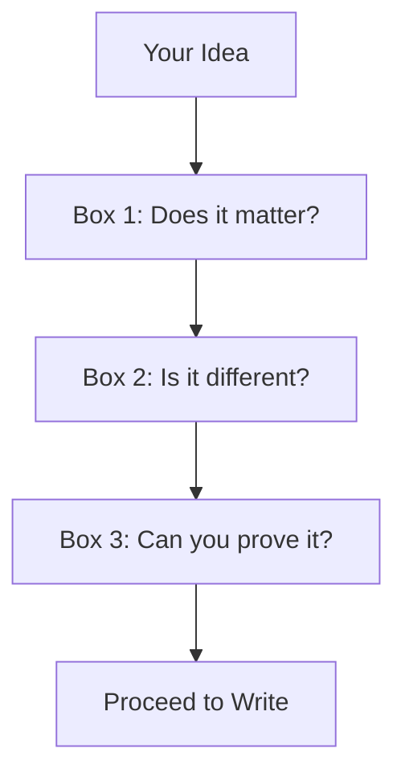

All three boxes must be checked before writing.

---

## The Croc Brain

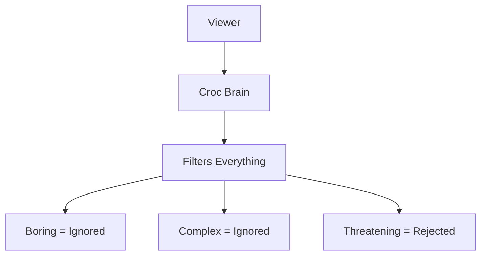

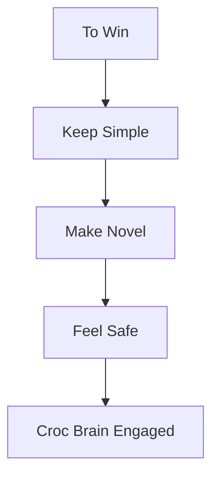

---

## Element Skills - Foundation

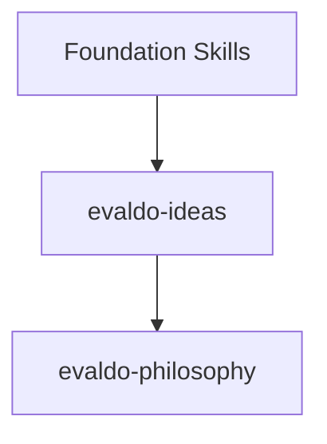

| Skill | Purpose |
|-------|---------|
| evaldo-ideas | Three Box + One Belief |
| evaldo-philosophy | VSL psychology |

---

## Element Skills - Structure

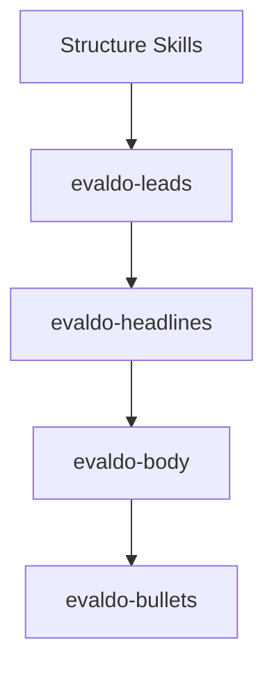

| Skill | Purpose |
|-------|---------|
| evaldo-leads | 10 Questions structure |
| evaldo-headlines | Croc brain hooks |
| evaldo-body | Mechanism revelation |
| evaldo-bullets | Fascination points |

---

## Element Skills - Conversion

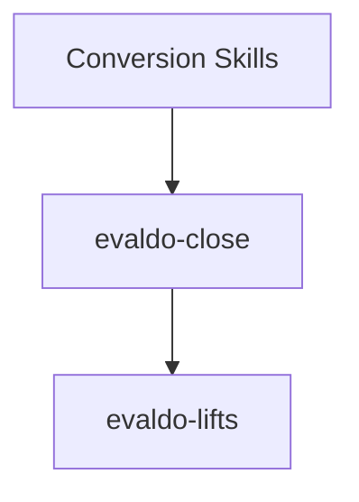

| Skill | Purpose |
|-------|---------|
| evaldo-close | VSL close structure |
| evaldo-lifts | Traffic email copy |

---

## The 10 Questions

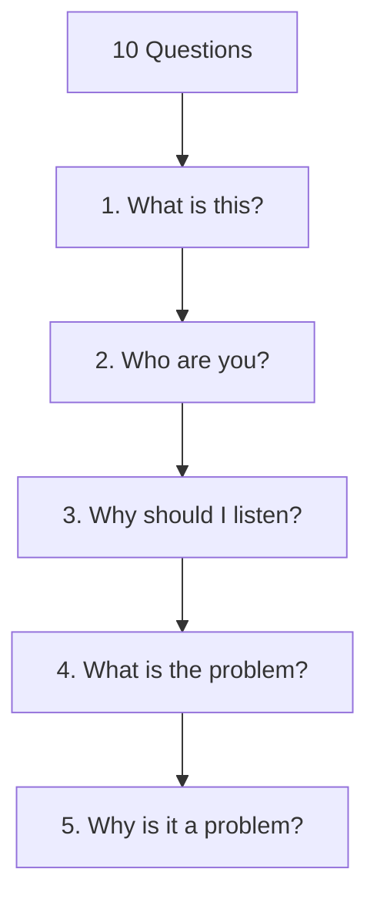

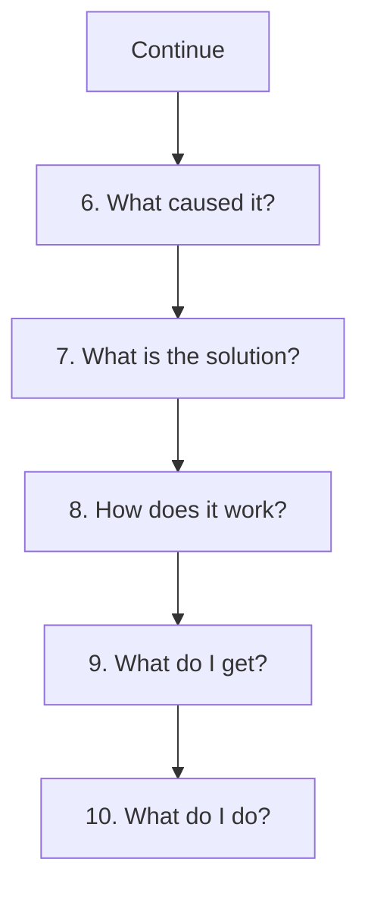

---

## Evaldo Critic Agent

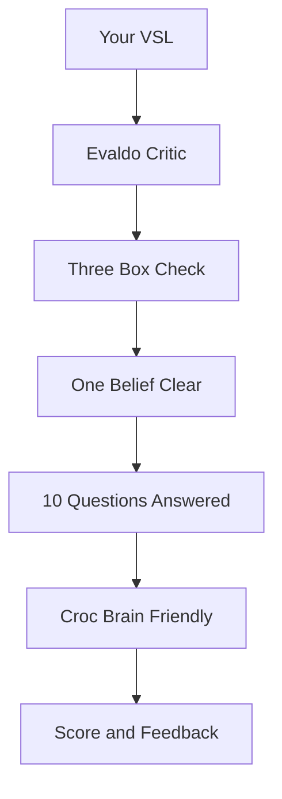

**What it evaluates:**
- Three Box compliance
- One Belief clarity
- 10 Questions structure
- Croc Brain optimization

---

## Quick Reference

| Need | Use Skill |
|------|-----------|
| Full VSL | evaldo |
| Idea validation | evaldo-ideas |
| VSL opening | evaldo-leads |
| Headlines | evaldo-headlines |
| Body copy | evaldo-body |
| Close section | evaldo-close |
| Traffic emails | evaldo-lifts |

---

*Part of the ZenithPro Copy Arsenal Diagram Set*
