# ZenithPro Copy Arsenal - John Carlton Skills

## Carlton System Overview

**200+ Frameworks | 16 Skills**

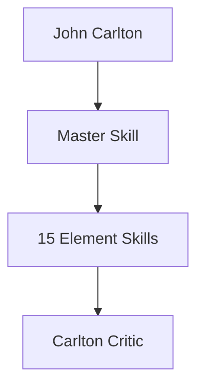

---

## Master Orchestrator

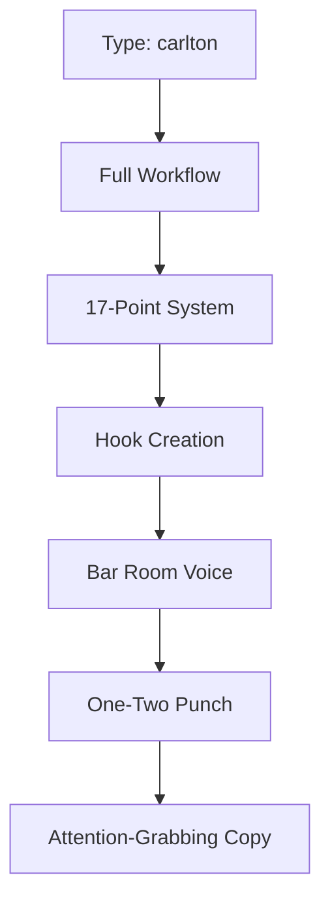

**Use when:** Need bold, personality-driven copy

---

## The 17-Point Simple Writing System

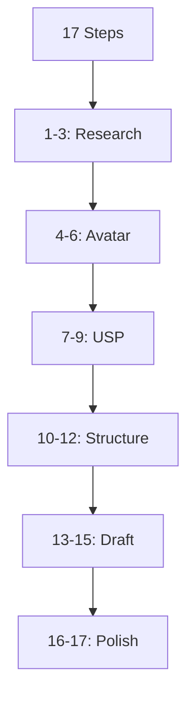

A complete system from blank page to finished copy.

---

## Incongruous Juxtaposition

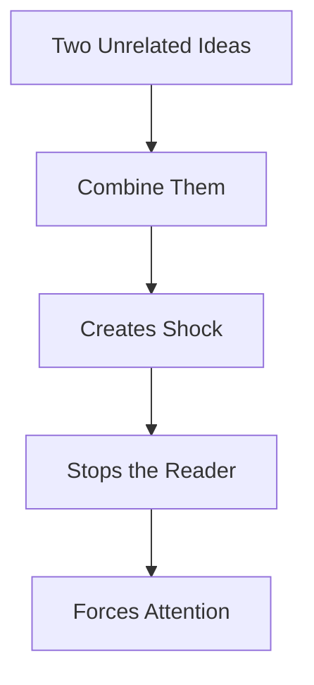

The core Carlton hook technique.

---

## Element Skills - Research

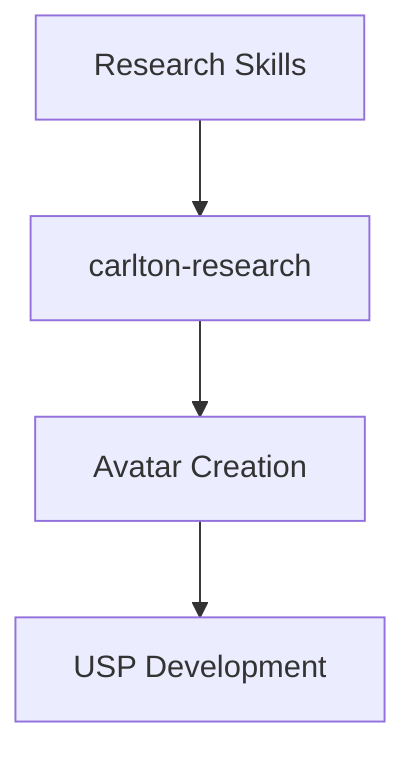

| Skill | Purpose |
|-------|---------|
| carlton-research | Steps 1-3 |
| Avatar embedded | Customer deep dive |
| USP embedded | Positioning |

---

## Element Skills - Hooks

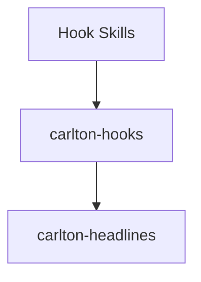

| Skill | Purpose |
|-------|---------|
| carlton-hooks | Incongruous juxtaposition |
| carlton-headlines | Attention grabbers |

---

## Element Skills - Body

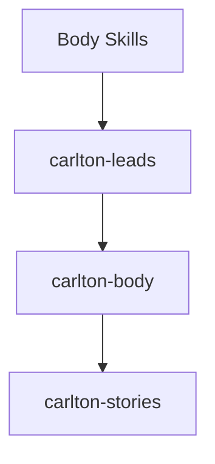

| Skill | Purpose |
|-------|---------|
| carlton-leads | Opening strategies |
| carlton-body | Bar room voice |
| carlton-stories | Story integration |

---

## Element Skills - Conversion

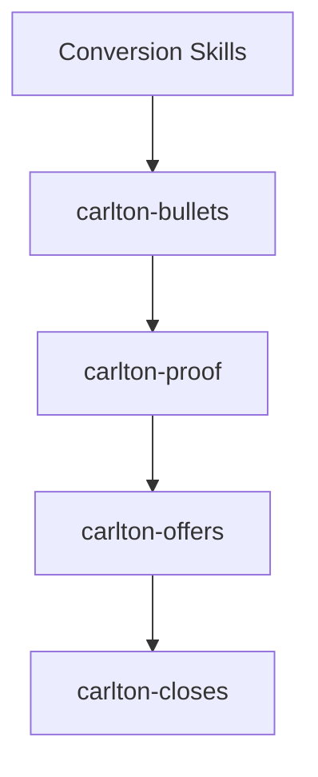

| Skill | Purpose |
|-------|---------|
| carlton-bullets | One-Two Punch |
| carlton-proof | Evidence stacking |
| carlton-offers | Stack construction |
| carlton-closes | Risk reversal |

---

## The One-Two Punch

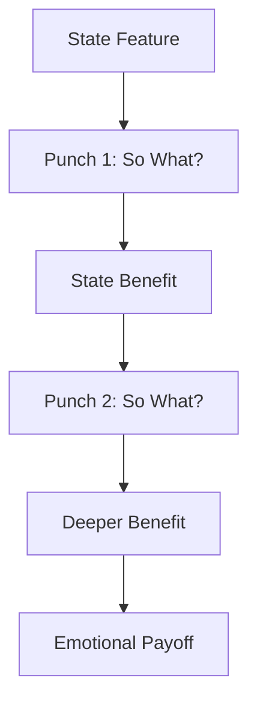

Never state a feature without the benefit chain.

---

## A-Brain Triggers

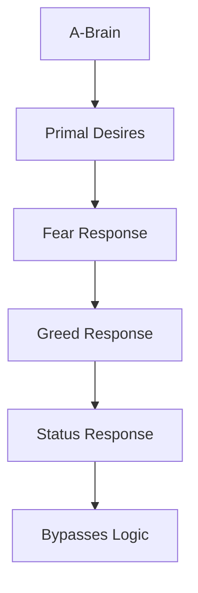

Carlton targets the primitive brain first.

---

## Carlton Critic Agent

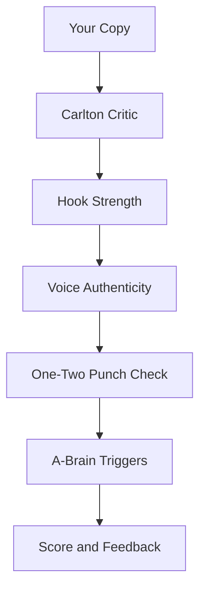

**What it evaluates:**
- 17-Point System compliance
- Incongruous Juxtaposition hooks
- Bar room voice consistency
- One-Two Punch execution

---

## Quick Reference

| Need | Use Skill |
|------|-----------|
| Full sales letter | carlton |
| Hooks | carlton-hooks |
| Headlines | carlton-headlines |
| Lead section | carlton-leads |
| Bullets | carlton-bullets |
| Offers | carlton-offers |
| Close | carlton-closes |

---

*Part of the ZenithPro Copy Arsenal Diagram Set*
