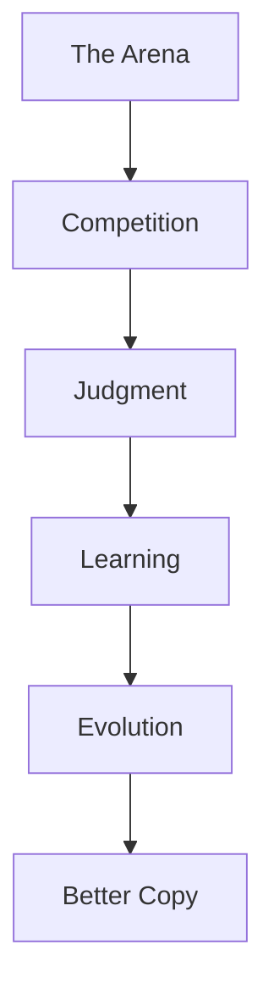
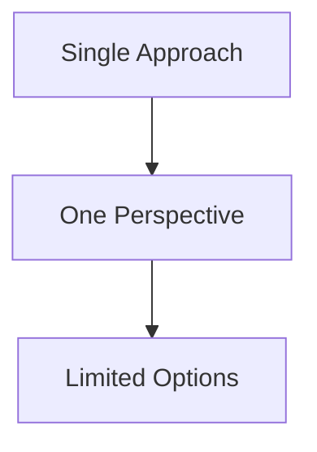
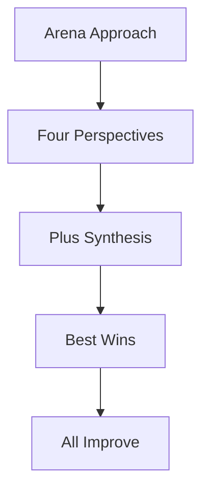
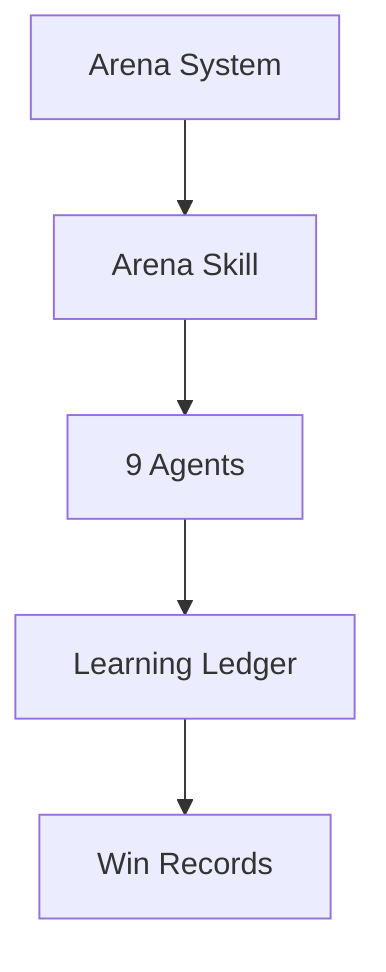
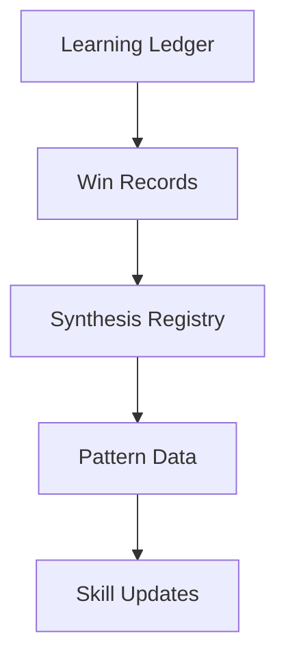
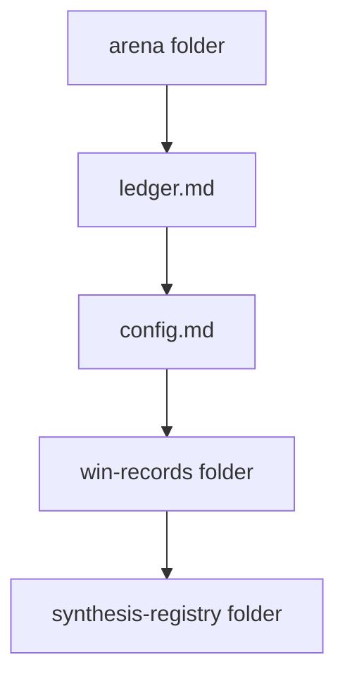
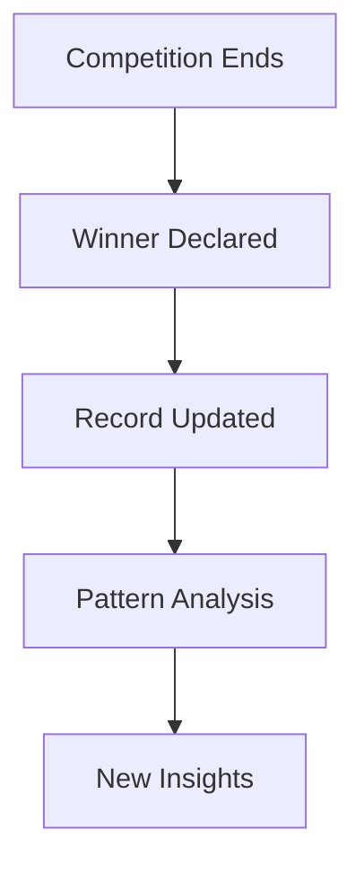
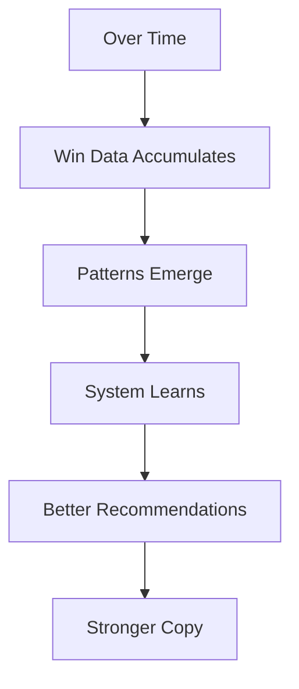

# ZenithPro Copy Arsenal - The Arena System

## What is the Arena?

The Arena is a competitive evolution engine where copywriters compete, learn, and improve automatically.

---

## Why Competition Works

---

## Arena Components

---

## The Learning Ledger

**Location:** ~/.claude/arena/

---

## Arena Folder Structure

| File | Purpose |
|------|---------|
| ledger.md | Overall statistics |
| config.md | Arena settings |
| win-records/ | Per-copywriter wins |
| synthesis-registry/ | Combination records |

---

## Win Record Tracking

Each copywriter has their own win record file tracking what types of projects they win.

---

## Why This Matters

The more you use the Arena, the smarter it gets about what works for your specific projects.

---

*Part of the ZenithPro Copy Arsenal Diagram Set*
