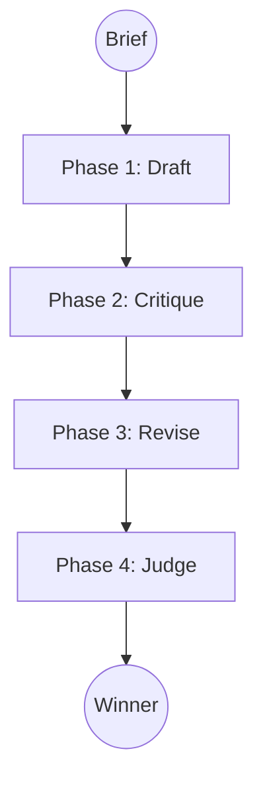
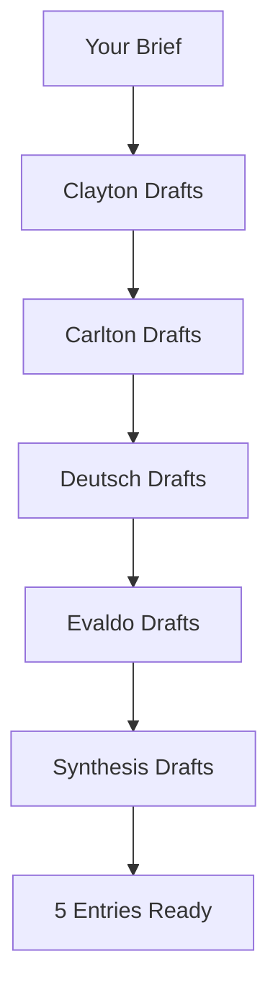
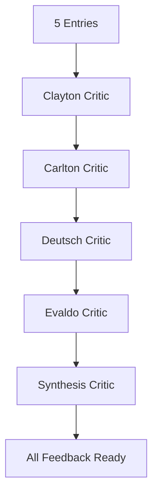
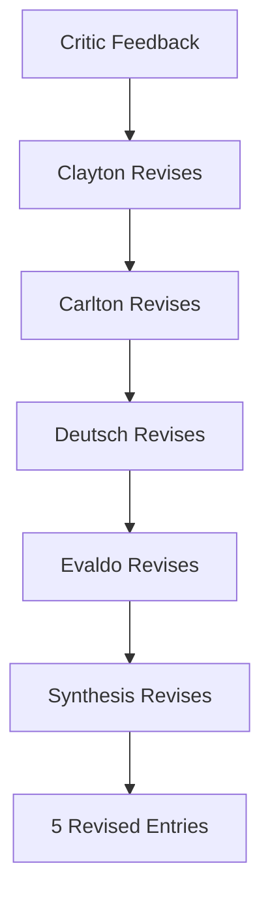
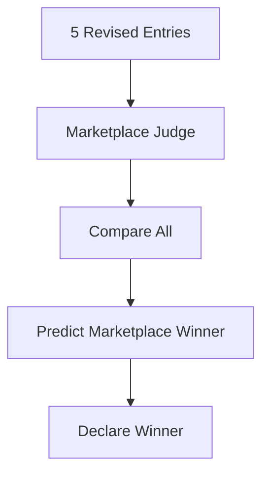
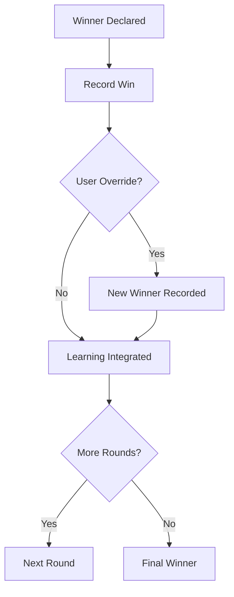
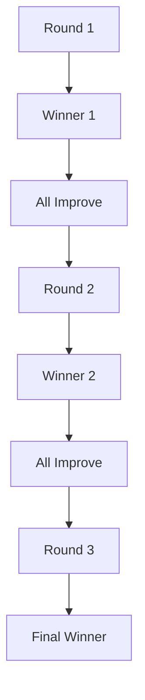
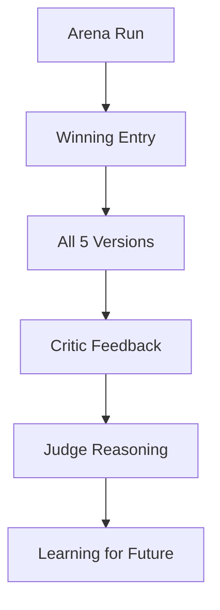

# ZenithPro Copy Arsenal - Arena Competition Flow

## How a Competition Works

---

## Phase 1: Drafting

All four masters plus one synthesis entry draft simultaneously.

---

## Phase 2: Critique

Each entry gets evaluated by its methodology critic.

---

## Phase 3: Revision

Each entry incorporates critic feedback.

---

## Phase 4: Judgment

The Marketplace Judge evaluates based on:
- Buyer psychology
- Direct response fundamentals
- Conversion probability

---

## After Judgment

---

## Multi-Round Competition

Each round, entries improve based on previous feedback.

---

## Running an Arena

**Command:** `/arena [project-name] [rounds]`

**Example:** `/arena landing-page 3`

This runs a 3-round competition for a landing page.

---

## What You Get

---

*Part of the ZenithPro Copy Arsenal Diagram Set*
