# ZenithPro Copy Arsenal - The 9 Agents

## Agent Overview

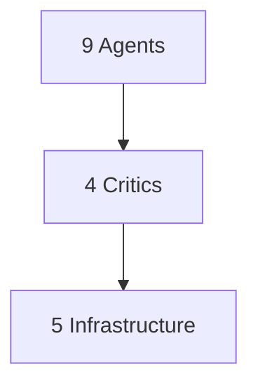

---

## The 4 Critic Agents

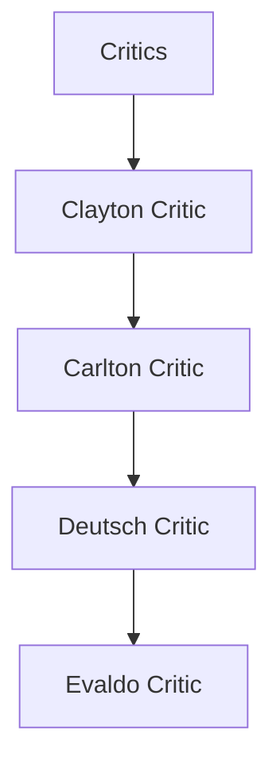

Each critic evaluates copy against its master's standards.

---

## Clayton Critic

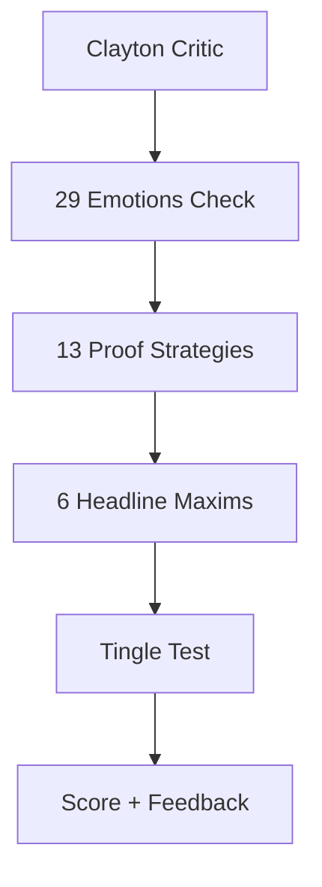

---

## Carlton Critic

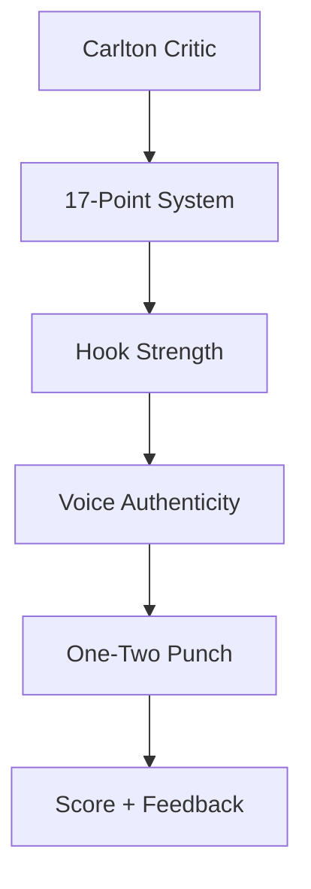

---

## Deutsch Critic

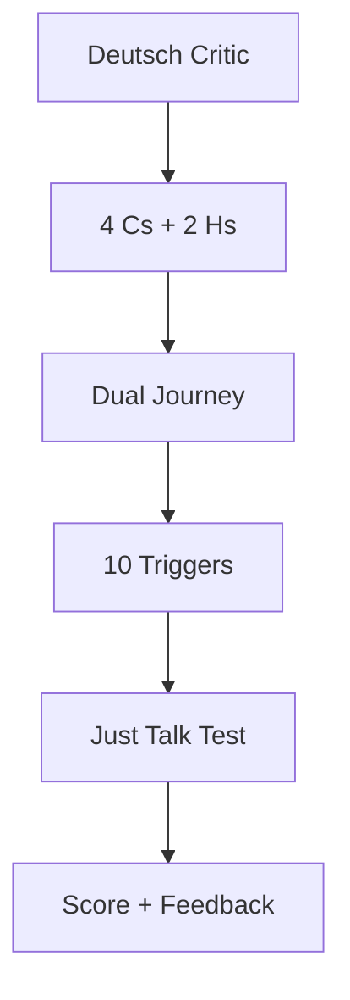

---

## Evaldo Critic

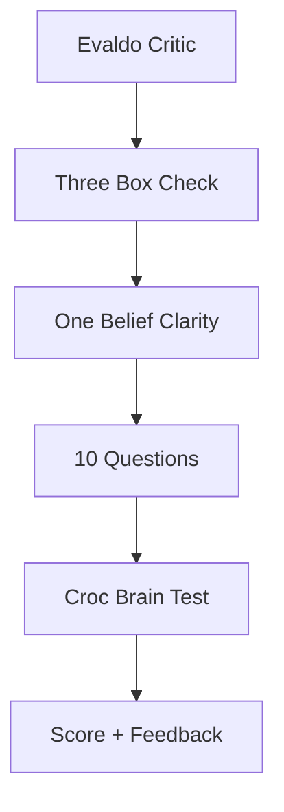

---

## The 5 Infrastructure Agents

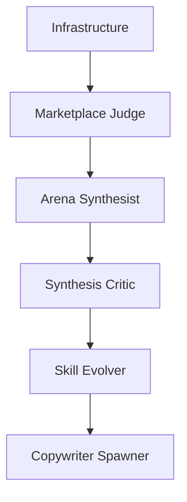

---

## Marketplace Judge

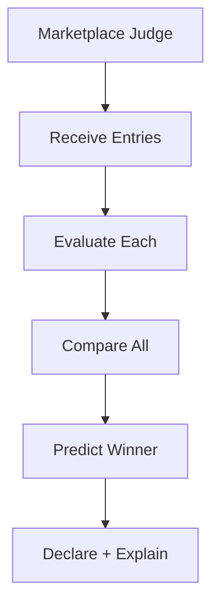

**Purpose:** Predicts which entry would win in the actual marketplace

**Evaluates:**
- Buyer psychology
- Direct response fundamentals
- Conversion probability

---

## Arena Synthesist

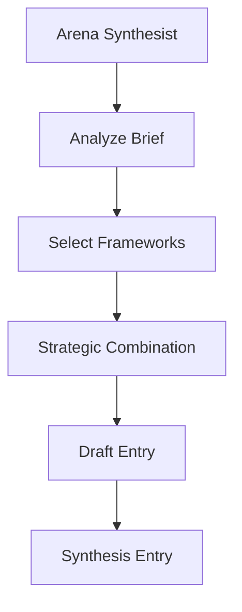

**Purpose:** Creates hybrid entries combining frameworks from multiple masters

---

## Synthesis Critic

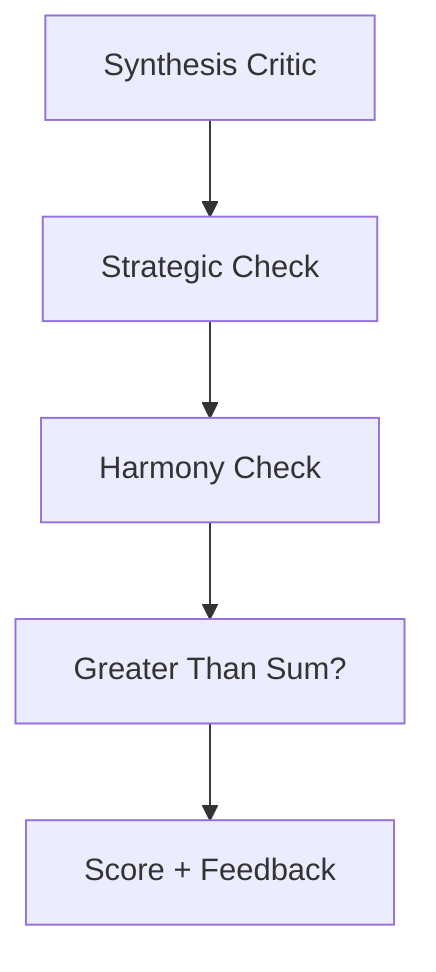

**Purpose:** Evaluates whether combinations work together effectively

---

## Skill Evolver

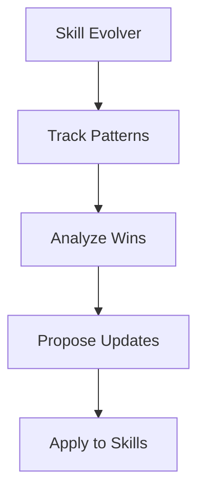

**Purpose:** Integrates learning into skills permanently

---

## Copywriter Spawner

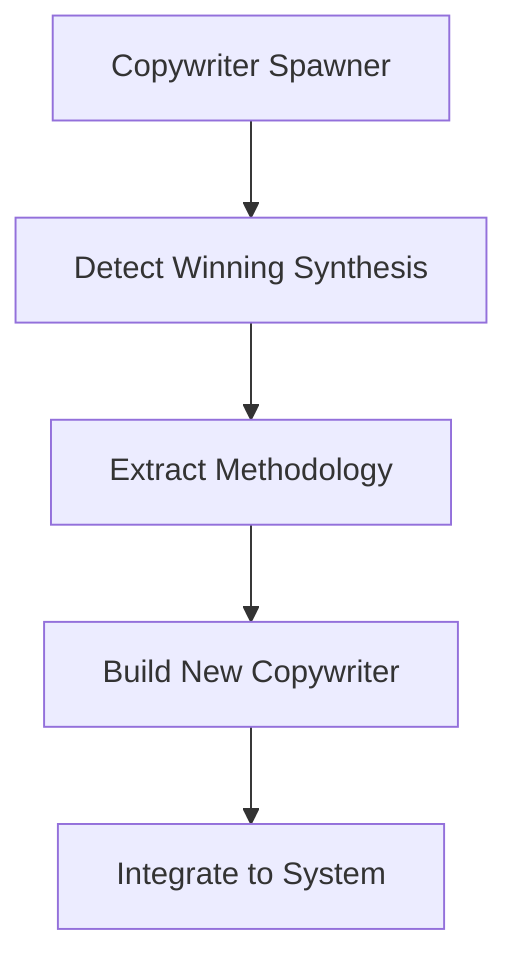

**Purpose:** Creates new copywriters from consistently winning synthesis combinations

---

## Agent Summary

| Agent | Role |
|-------|------|
| Clayton Critic | Evaluate vs Clayton standards |
| Carlton Critic | Evaluate vs Carlton standards |
| Deutsch Critic | Evaluate vs Deutsch standards |
| Evaldo Critic | Evaluate vs Evaldo standards |
| Marketplace Judge | Declare Arena winners |
| Arena Synthesist | Create hybrid entries |
| Synthesis Critic | Evaluate combinations |
| Skill Evolver | Update skills from learning |
| Copywriter Spawner | Birth new copywriters |

---

*Part of the ZenithPro Copy Arsenal Diagram Set*
