# ZenithPro Copy Arsenal - Evolution System

## The Evolution Cycle

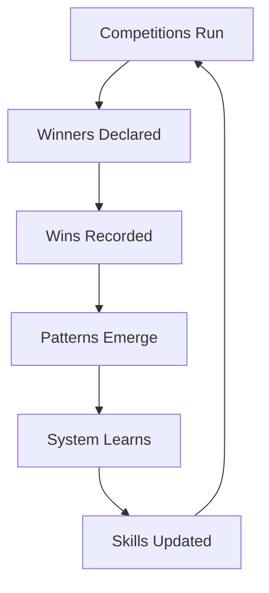

---

## How Skills Improve

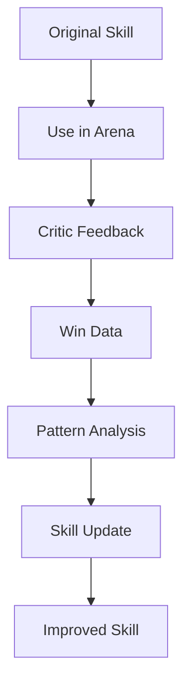

---

## Win Pattern Tracking

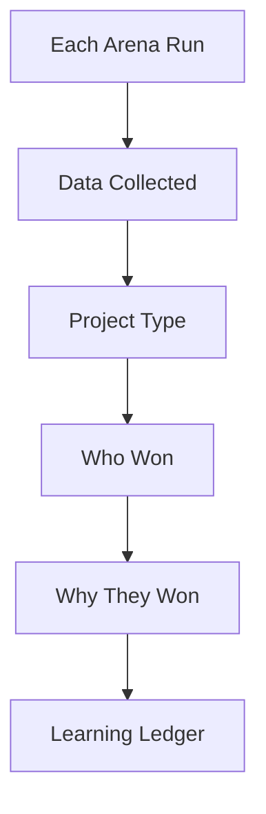

Over time, patterns emerge showing which copywriter wins for which project types.

---

## The Learning Ledger

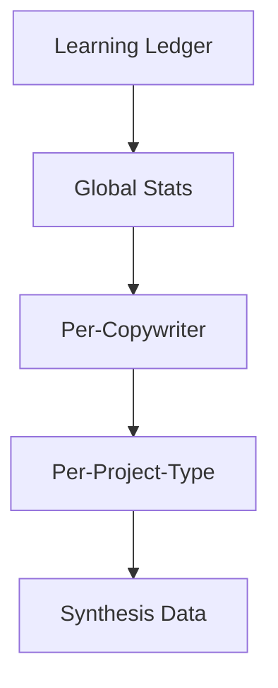

---

## Skill Evolver Process

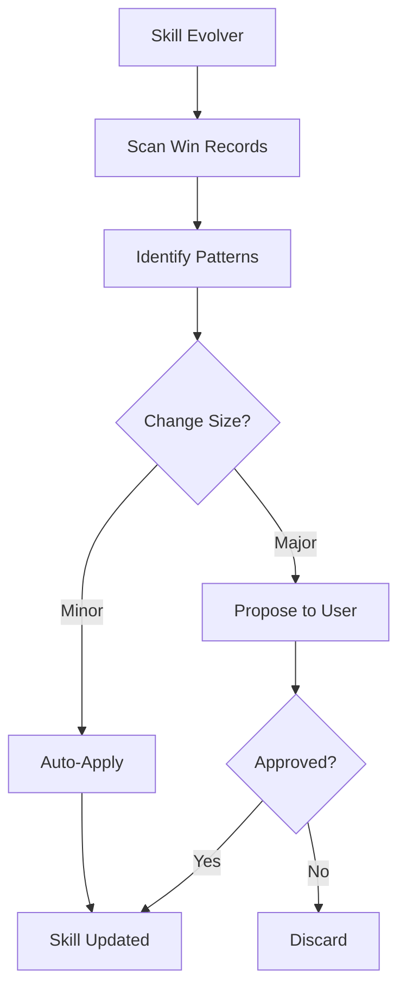

---

## What Gets Learned

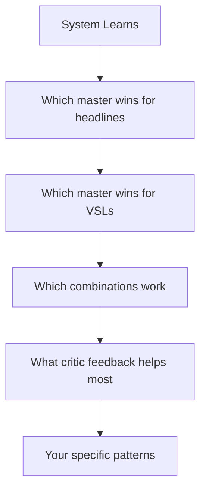

---

## Synthesis Evolution

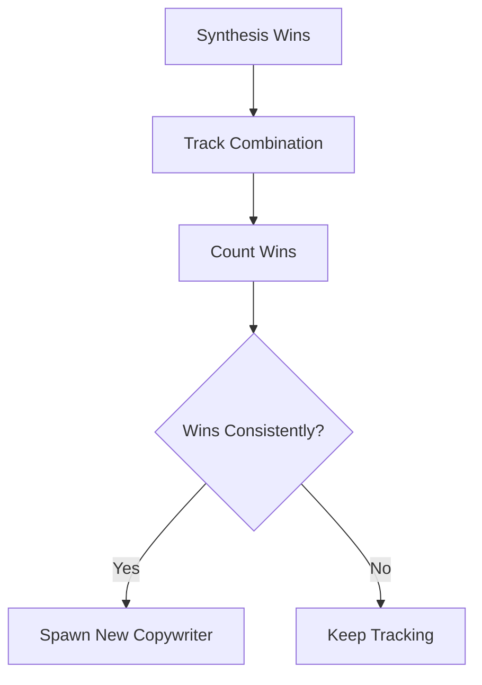

---

## Copywriter Spawning

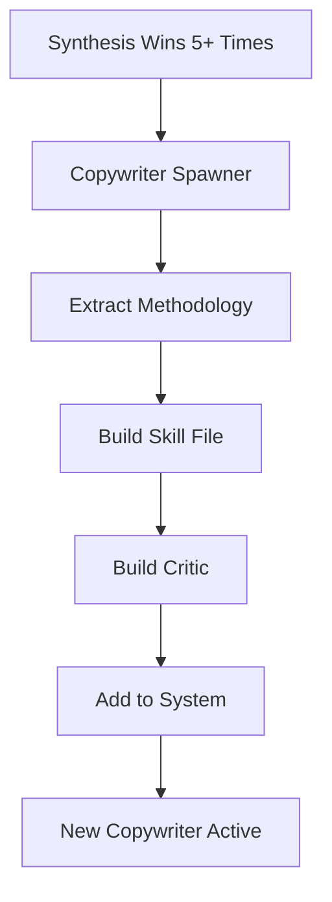

When a synthesis combination wins consistently, it becomes a new copywriter.

---

## Why This Matters

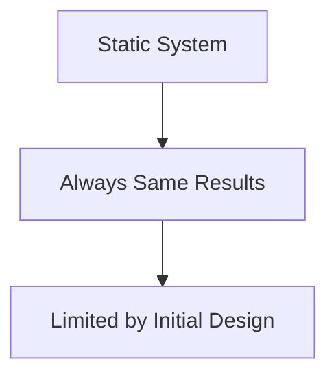

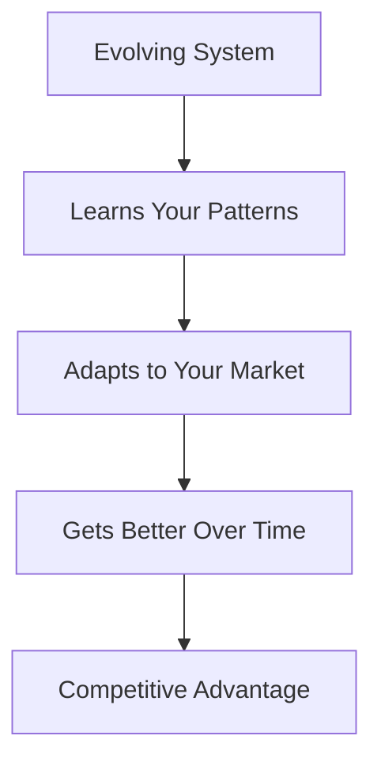

---

## Your Advantage Grows

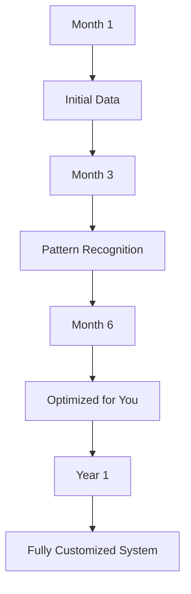

The more you use it, the more valuable it becomes.

---

*Part of the ZenithPro Copy Arsenal Diagram Set*
