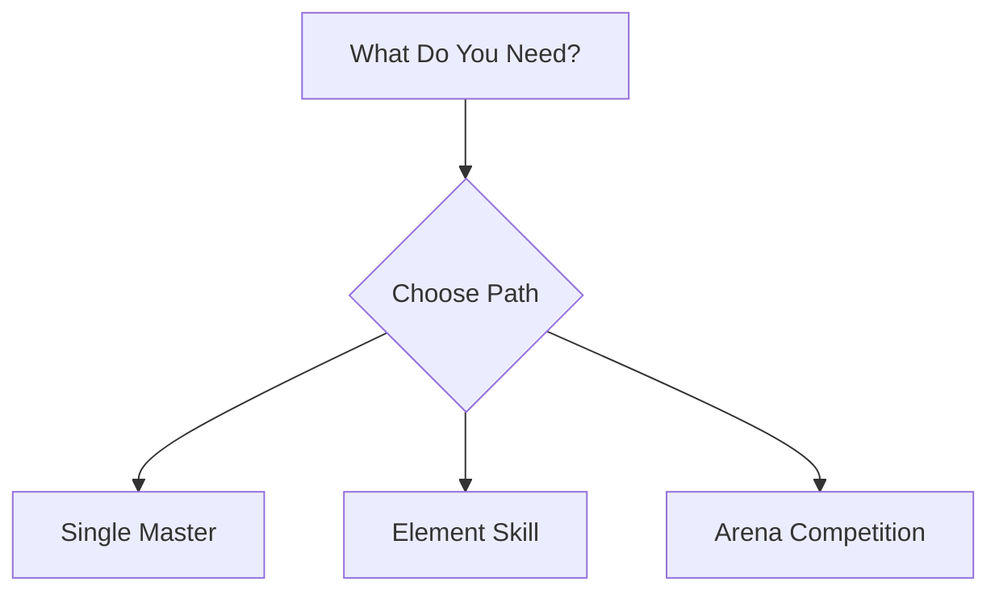
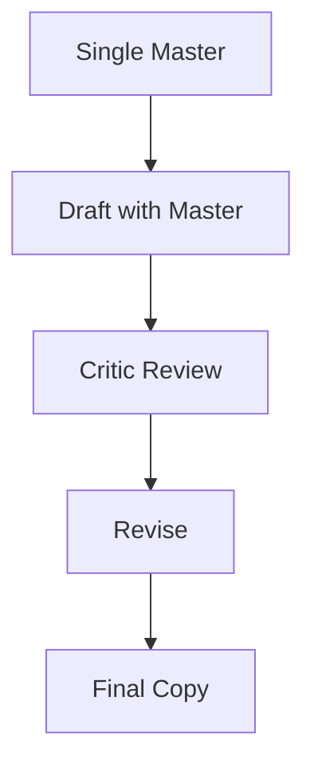
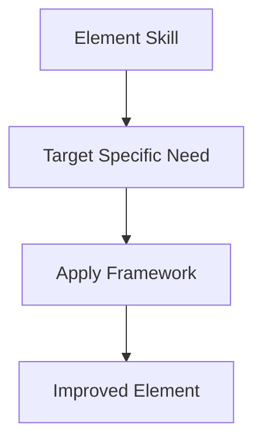
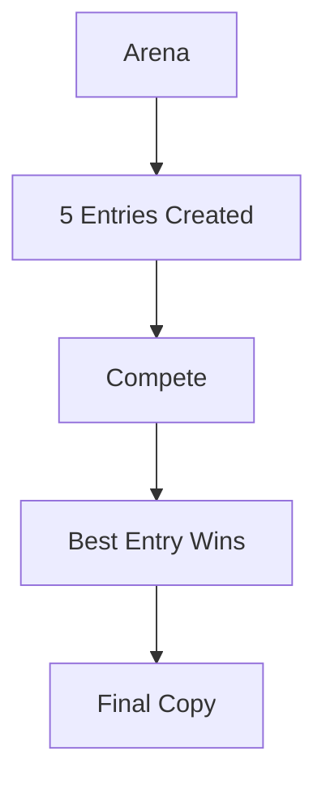
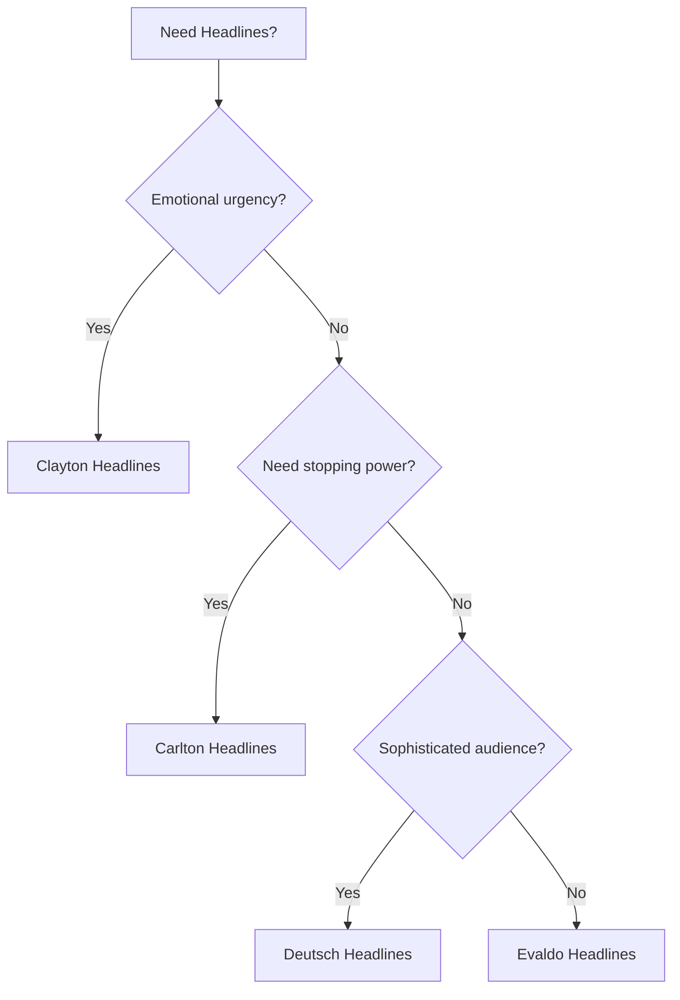
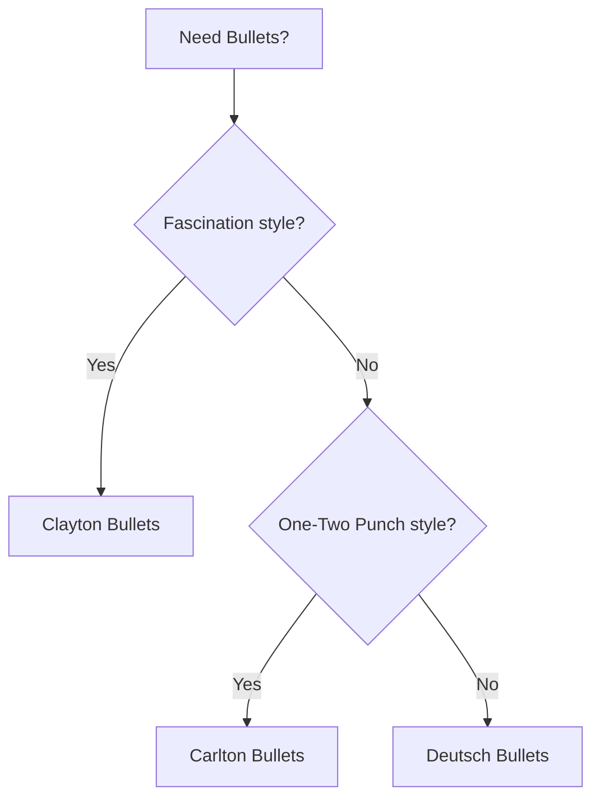
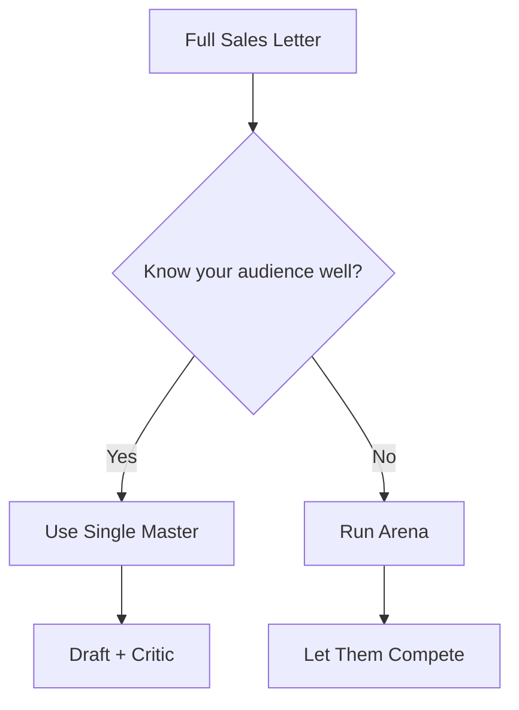
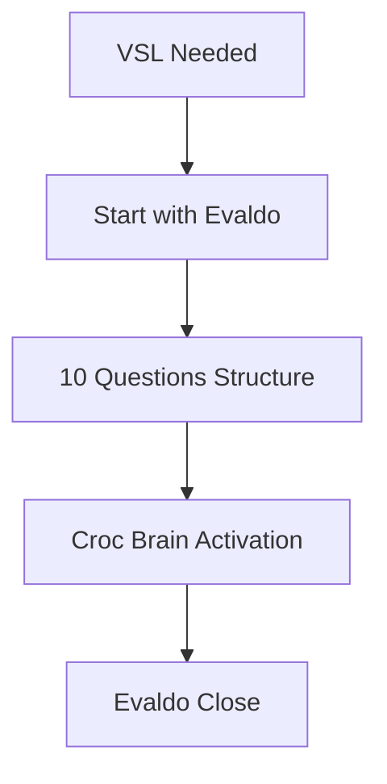
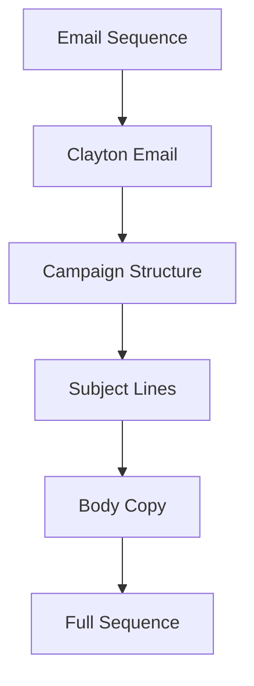

# ZenithPro Copy Arsenal - Workflow Selection

## Choosing Your Path

---

## Path 1: Single Master

**Use when:** You know which approach fits best

---

## Path 2: Element Skill

**Use when:** You need surgical improvement to one section

---

## Path 3: Arena Competition

**Use when:** Maximum quality matters more than speed

---

## Which Master for What?

| Project Type | Recommended Master |
|--------------|-------------------|
| Health supplement | Clayton |
| Financial newsletter | Clayton |
| Bold personality brand | Carlton |
| Attention-grabbing hook | Carlton |
| High-end sophisticated | Deutsch |
| Educated audience | Deutsch |
| Video sales letter | Evaldo |
| Webinar script | Evaldo |

---

## Headlines

---

## Bullets

---

## Full Sales Letter

---

## VSL or Video Script

Evaldo's methodology is purpose-built for VSLs.

---

## Email Sequence

---

## Quick Reference

| Need | Use |
|------|-----|
| Complete sales letter | Master skill (clayton, carlton, deutsch, evaldo) |
| Just headlines | Element skill (clayton-headlines, etc) |
| Just bullets | Element skill (clayton-bullets, etc) |
| Maximum quality | Arena competition |
| Fast improvement | Element skill for that section |
| VSL | evaldo |
| Email campaign | clayton-email |
| Bold hooks | carlton-hooks |

---

*Part of the ZenithPro Copy Arsenal Diagram Set*
