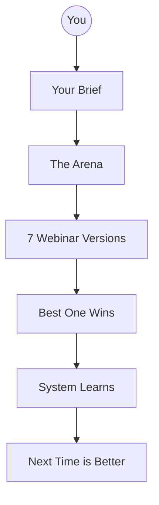

# Webinar Arena - Visual Guide

These diagrams help you understand how the Webinar Arena works. Start at the top and work your way down.

---

## Start Here

| Diagram | What You Will Learn |
|---------|---------------------|
| [[01-What-Is-The-Arena]] | The big picture in 60 seconds |
| [[02-The-Six-Masters]] | Meet the 6 webinar experts |
| [[03-How-To-Use-It]] | Running your first competition |

---

## Going Deeper

| Diagram | What You Will Learn |
|---------|---------------------|
| [[04-Competition-Phases]] | The 7 phases explained |
| [[05-What-You-Get]] | Understanding your outputs |
| [[06-How-Judgment-Works]] | How winners are chosen |

---

## Advanced

| Diagram | What You Will Learn |
|---------|---------------------|
| [[07-Evolution-And-Spawning]] | How the system improves |
| [[08-Which-Expert-When]] | Picking the right approach |

---

## The Arena in One Picture

---

*ZenithPro Webinar Arena v1.0*
