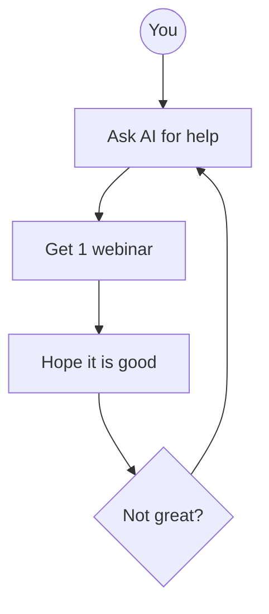
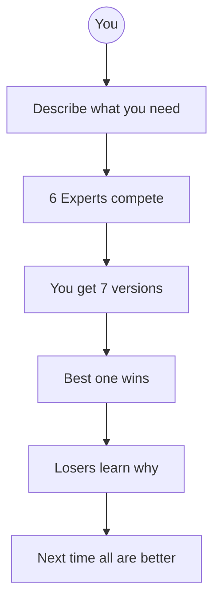
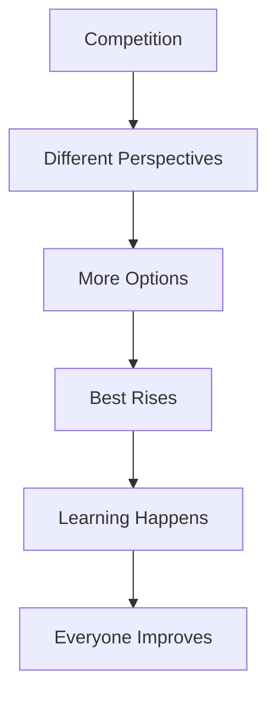
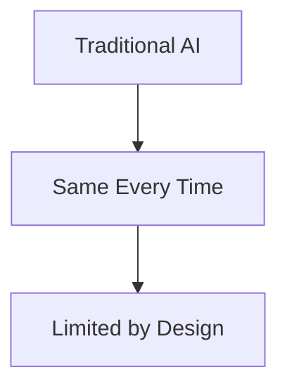
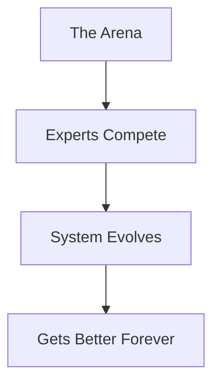

# What Is The Webinar Arena?

The Arena is where 6 webinar experts compete to create the best webinar for YOUR specific project.

---

## The Old Way vs The Arena Way

### The Old Way

You get one output. If it is not great, you try again with the same approach.

---

### The Arena Way

You get 7 different approaches. A judge picks the best. The system learns and improves.

---

## Why Competition Works

---

## What Makes It Revolutionary

The more you use it, the smarter it becomes.

---

## Quick Stats

| What You Get | Count |
|--------------|-------|
| Webinar Experts | 6 |
| Total Frameworks | 604 |
| Versions Per Run | 7 |
| Agents Working | 11 |

---

*Next: [[02-The-Six-Masters]] - Meet the experts*
