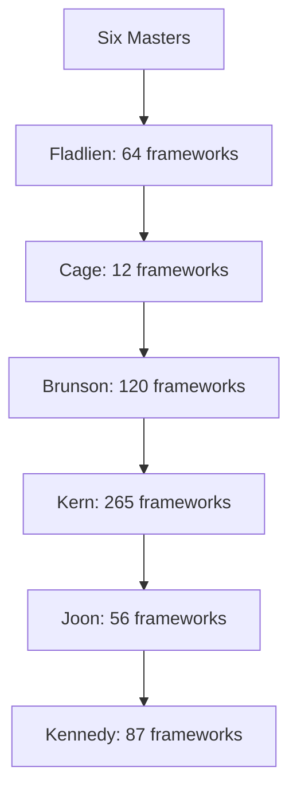
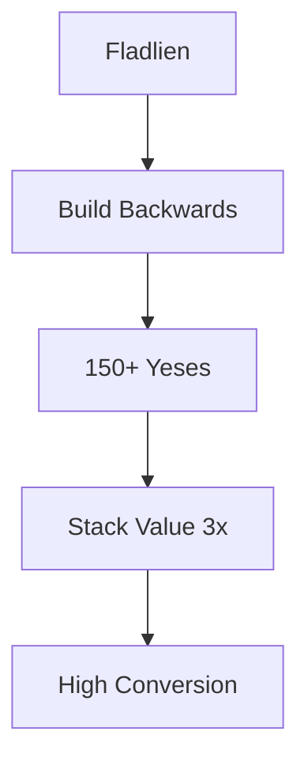
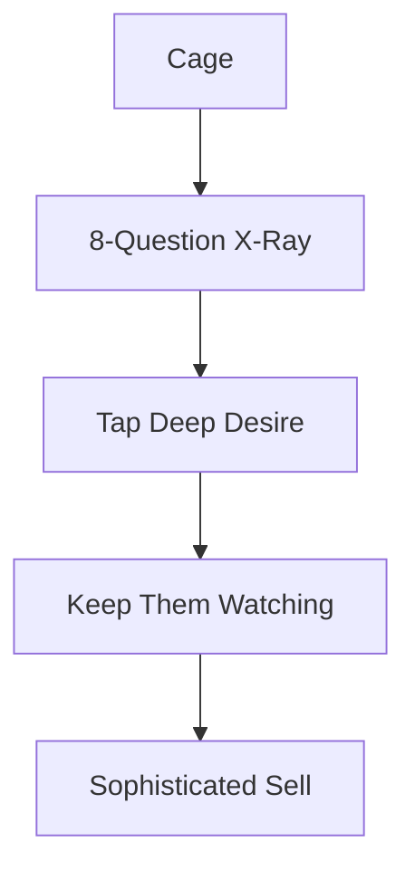
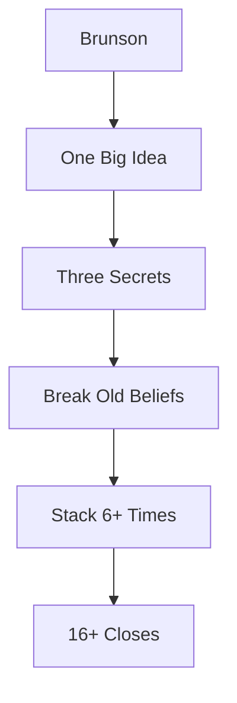
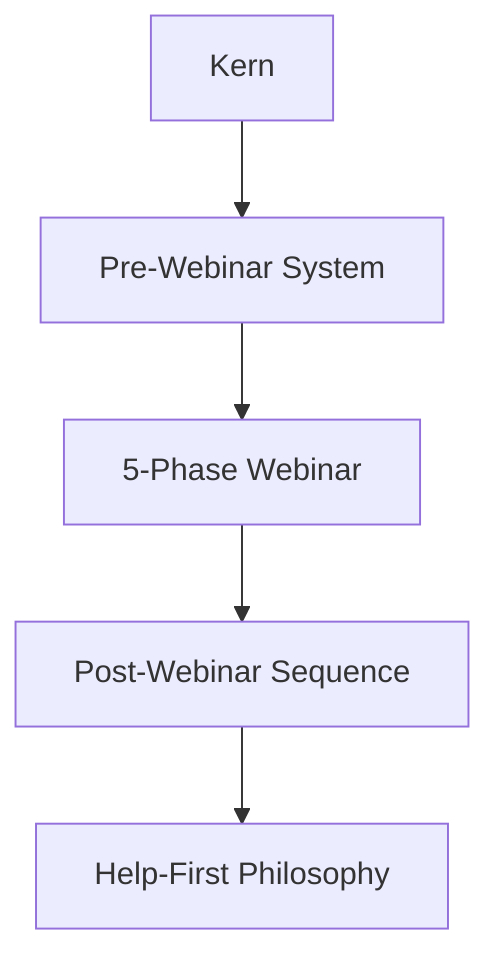
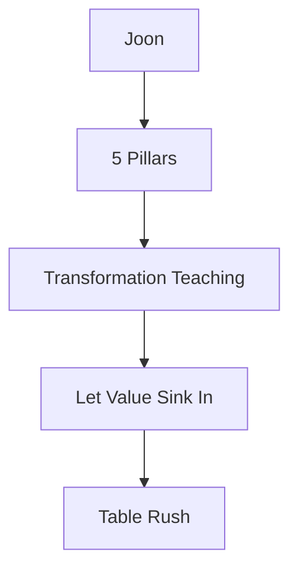
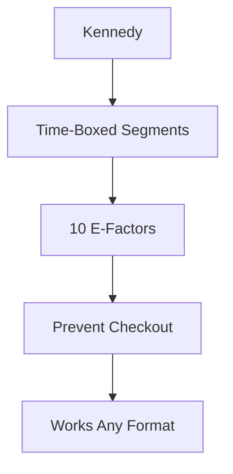
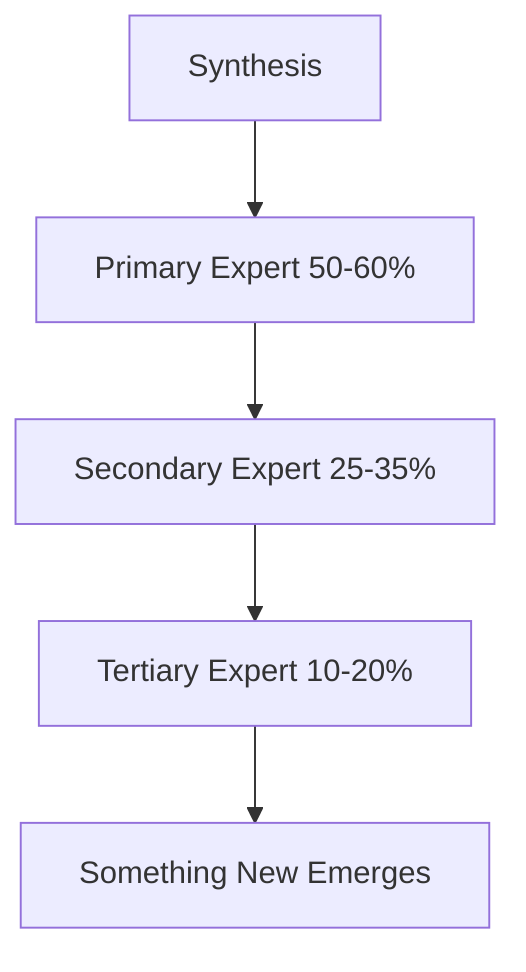

# The Six Webinar Masters

Six legendary experts. Six distinct philosophies. Each brings different strengths to your webinar.

---

## The Six Experts

Plus one Synthesis entry that combines the best of multiple experts.

---

## Jason Fladlien

**The Efficiency Expert** - 64 Frameworks

**Best For:** Automated funnels, mass markets, under $500

---

## Michael Cage

**The Psychologist** - 12 Frameworks

**Best For:** Sophisticated buyers, retention focus, seen-everything markets

---

## Russell Brunson

**The Energy Machine** - 120 Frameworks

**Best For:** Live webinars, paradigm shifts, emotional connection

---

## Frank Kern

**The Campaign Architect** - 265 Frameworks

**Best For:** Complete campaigns, relationship selling, hate-hype markets

---

## Peng Joon

**The Event Master** - 56 Frameworks

**Best For:** Live stage events, high-ticket ($5K+), transformation offers

---

## Dan Kennedy

**The Precision Engineer** - 87 Frameworks

**Best For:** Any format, tight timing, professional audiences

---

## Plus: Synthesis

The 7th competitor strategically combines frameworks from multiple experts.

**Best For:** Unusual requirements, mixed audiences, when no single expert fits

---

## Quick Reference

| Expert | Sweet Spot |
|--------|------------|
| Fladlien | Under $500, automated, mass market |
| Cage | Sophisticated, skeptical, retention |
| Brunson | Live, paradigm shift, emotional |
| Kern | Complete campaign, relationship, help-first |
| Joon | Live event, $5K+, transformation |
| Kennedy | Any format, precision, efficiency |
| Synthesis | Unusual, conflicting, mixed |

---

*Next: [[03-How-To-Use-It]] - Run your first competition*
