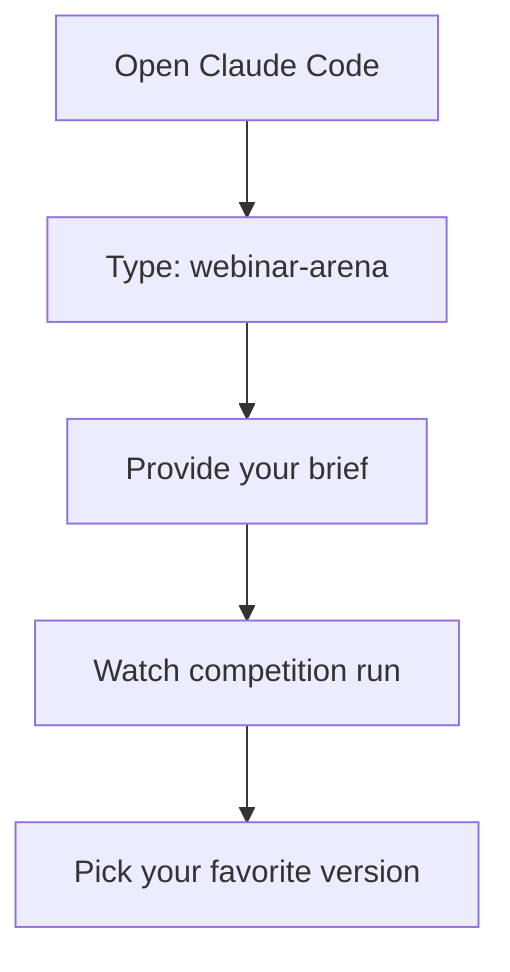
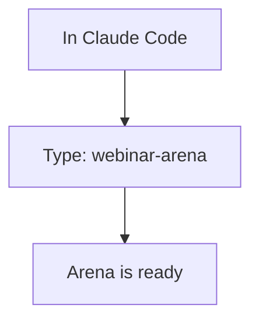
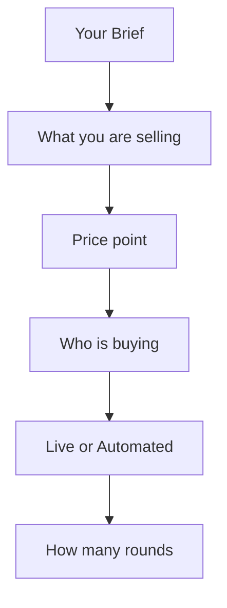
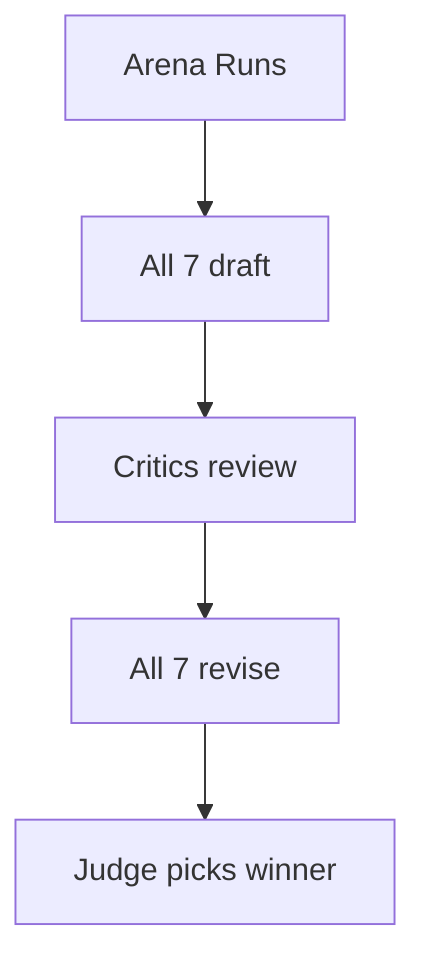
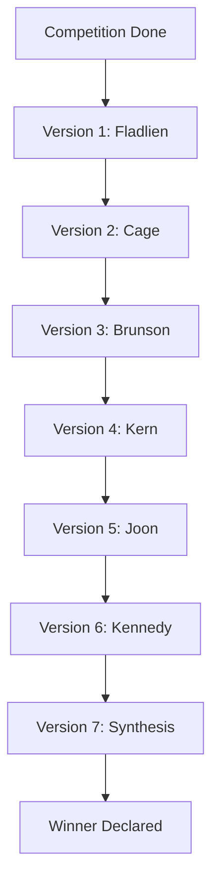
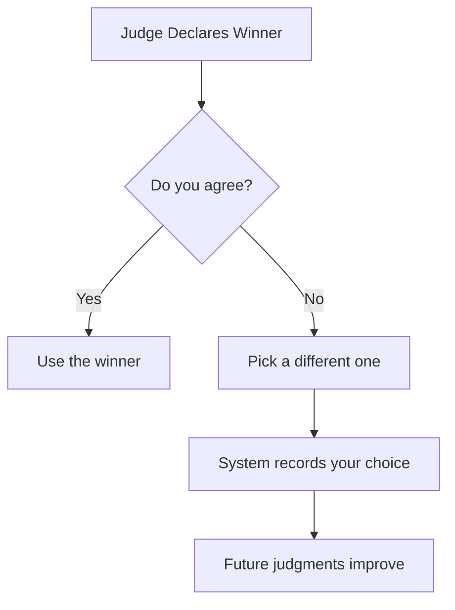
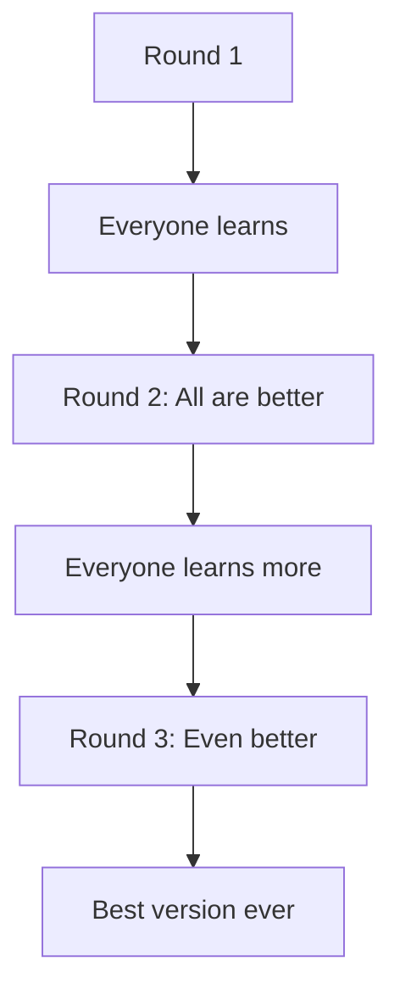

# How To Use The Arena

Your first competition in 5 minutes.

---

## The Simple Version

That is it. Four steps.

---

## Step 1: Start The Arena

---

## Step 2: Provide Your Brief

Tell the Arena what you need:

**Example Brief:**
- Brief: Webinar selling $997 course to business owners
- Price: $997
- Market sophistication: 3
- Format: Automated
- Rounds: 1

---

## Step 3: Watch The Competition

---

## Step 4: Get Your Results

---

## What You Receive

| Output | What It Is |
|--------|-----------|
| 7 webinar versions | Complete structures from each expert |
| Rankings | Scored 1-7 with explanations |
| Judge reasoning | Why the winner won |
| Learning briefs | What each expert learned |

---

## Your Choice

You always have the final say.

---

## Multiple Rounds

For important projects, run multiple rounds:

Each round makes everyone better.

---

## Quick Start Checklist

- [ ] Open Claude Code
- [ ] Type: webinar-arena
- [ ] Write your brief
- [ ] Watch competition run
- [ ] Review all 7 versions
- [ ] Pick your favorite

---

*Next: [[04-Competition-Phases]] - See what happens in each phase*
