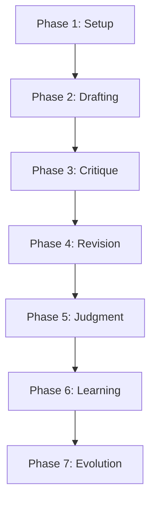
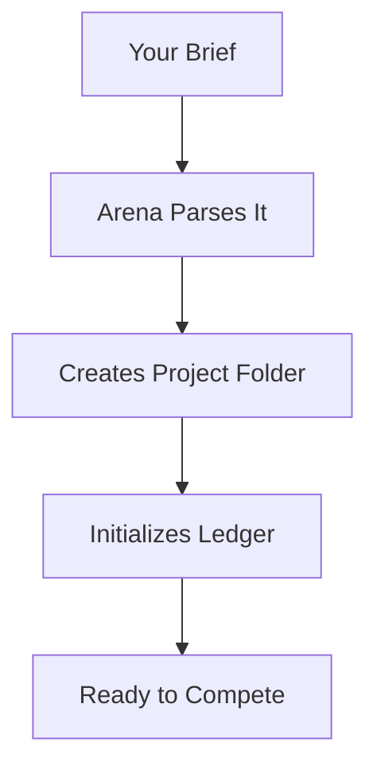
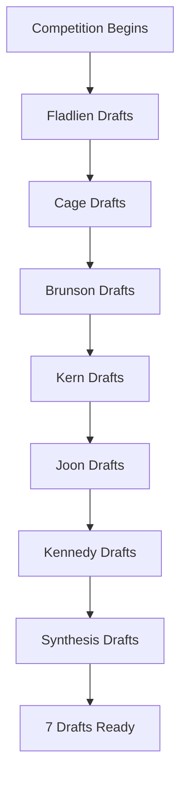
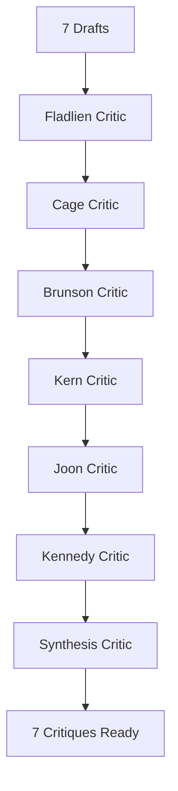
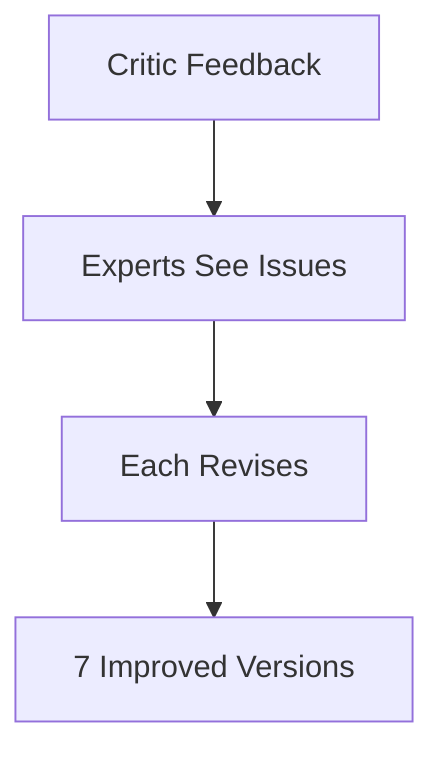
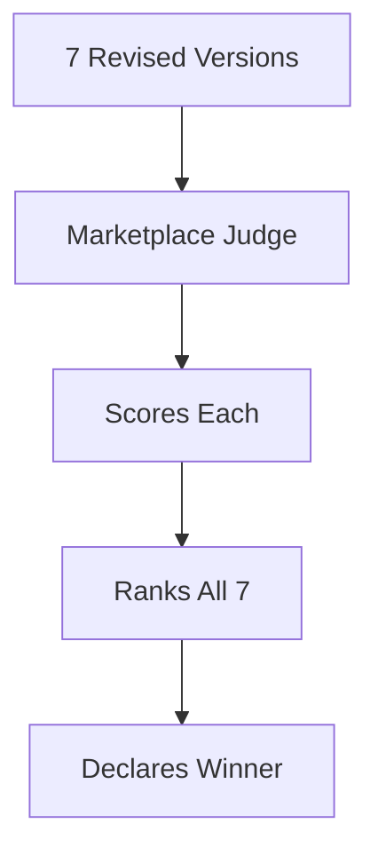
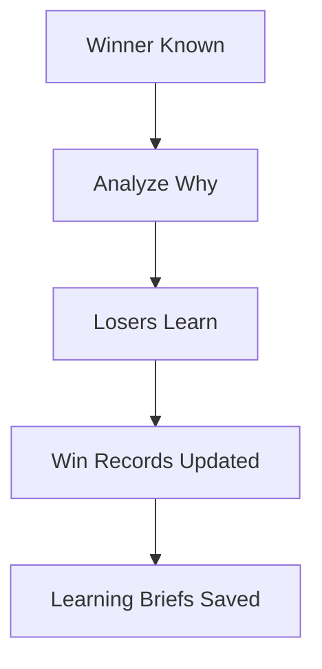
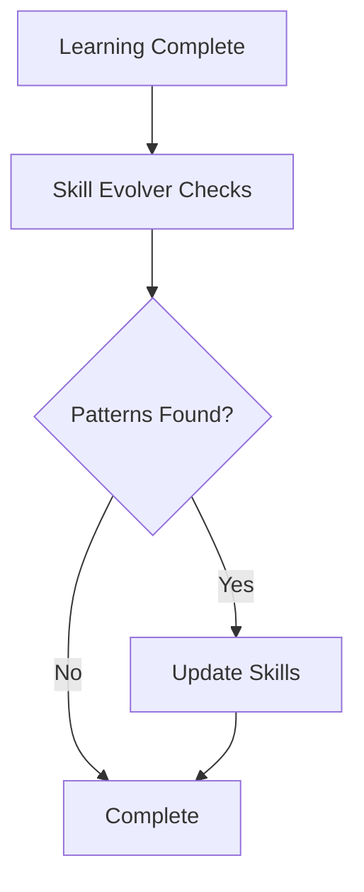
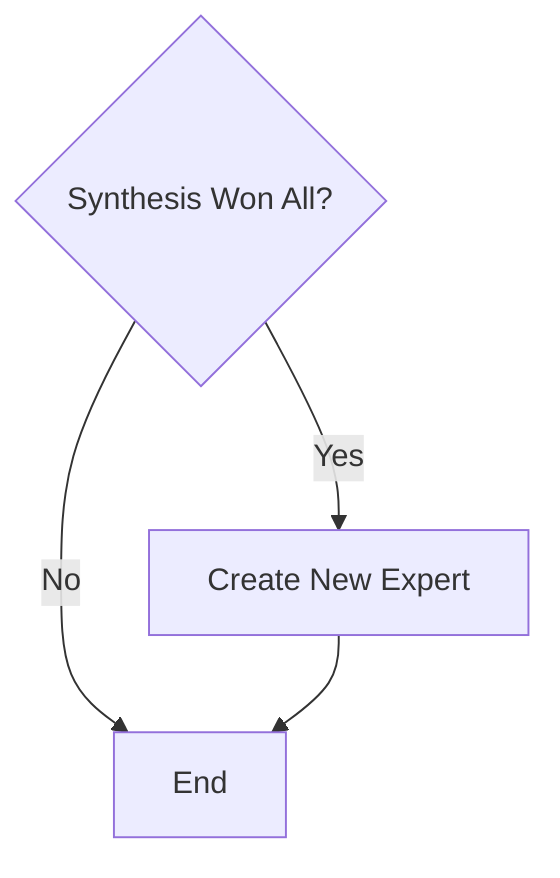
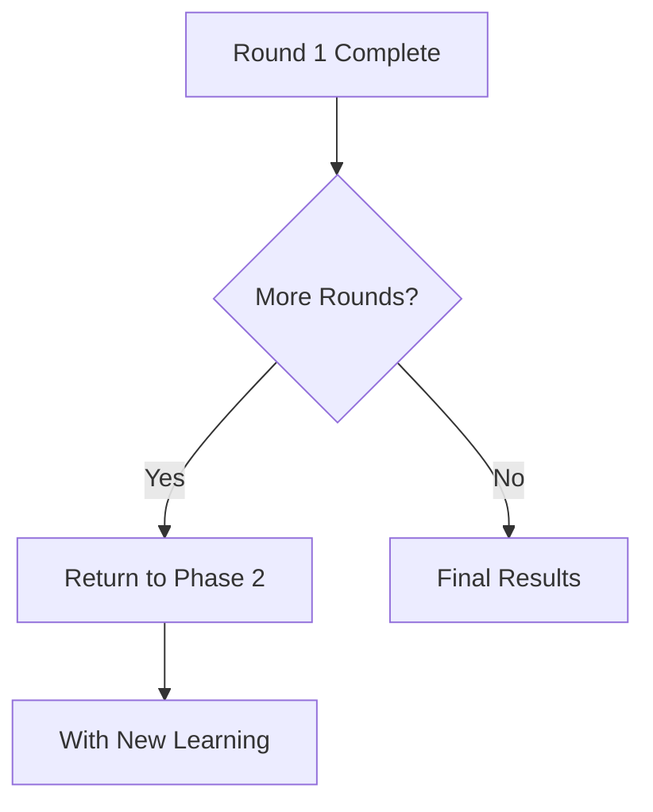

# The 7 Competition Phases

What happens from brief to winner.

---

## The Full Flow

---

## Phase 1: Setup

The Arena understands your project and prepares the competition.

---

## Phase 2: Parallel Drafting

All 7 competitors work at the same time.

Each uses their own methodology on your brief.

---

## Phase 3: Parallel Critique

Each draft is evaluated by its methodology critic.

Critics check against their expert's specific frameworks.

---

## Phase 4: Parallel Revision

Each expert improves based on critique.

---

## Phase 5: Judgment

The Judge predicts which would win in the real marketplace.

---

## Phase 6: Learning

Every competitor learns from the outcome.

---

## Phase 7: Evolution

The system improves for next time.

---

## Multiple Rounds

Each round builds on previous learning.

---

## Phase Summary

| Phase | What Happens | Output |
|-------|--------------|--------|
| 1. Setup | Parse brief, create project | Ready to compete |
| 2. Drafting | All 7 create versions | 7 draft webinars |
| 3. Critique | Each critic evaluates | 7 critiques |
| 4. Revision | All improve | 7 revised versions |
| 5. Judgment | Judge picks winner | Ranked results |
| 6. Learning | Analyze what worked | Learning briefs |
| 7. Evolution | Update skills | System improves |

---

*Next: [[05-What-You-Get]] - Understanding your outputs*
