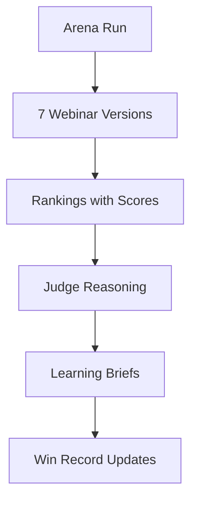
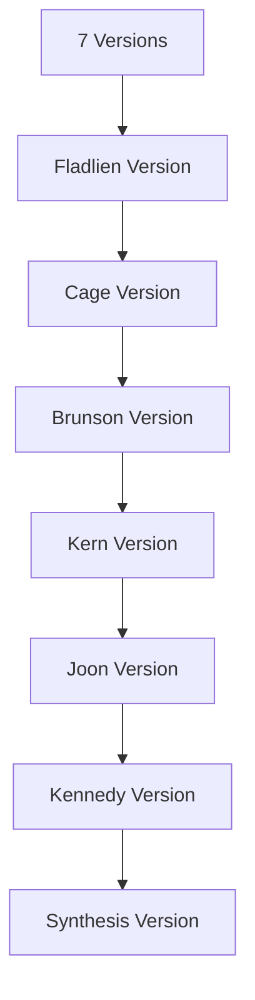
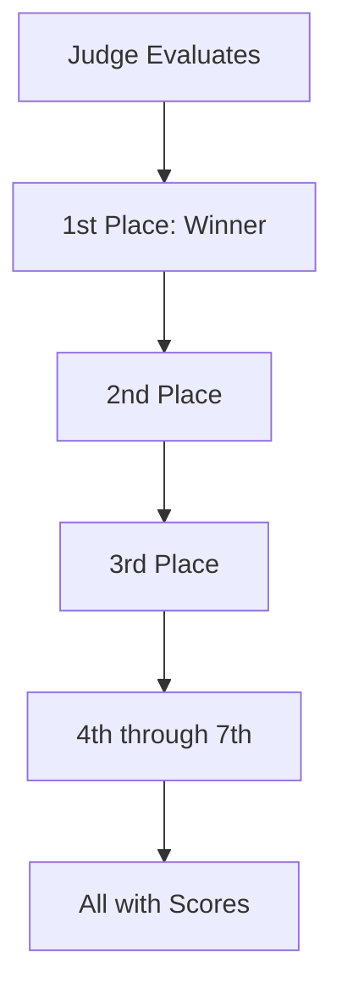
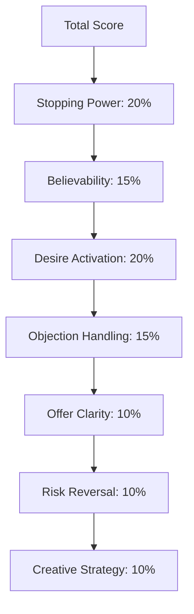
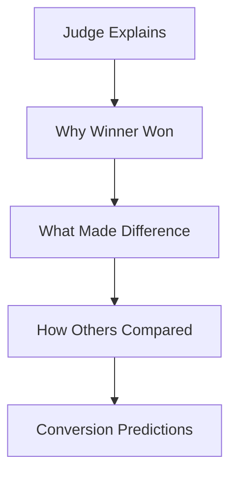
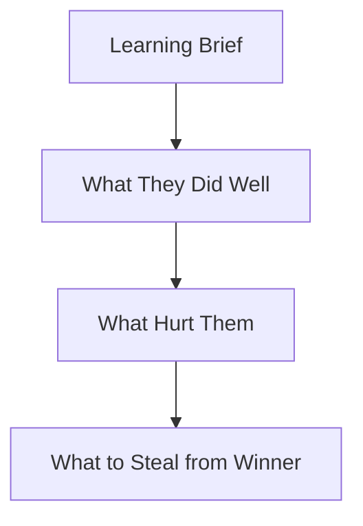
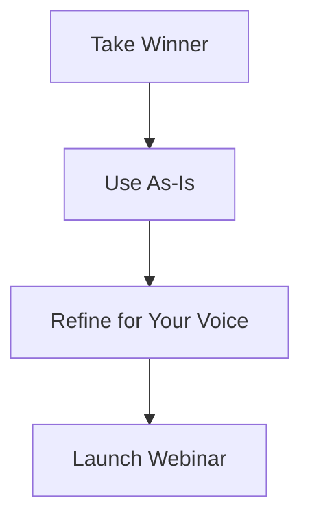
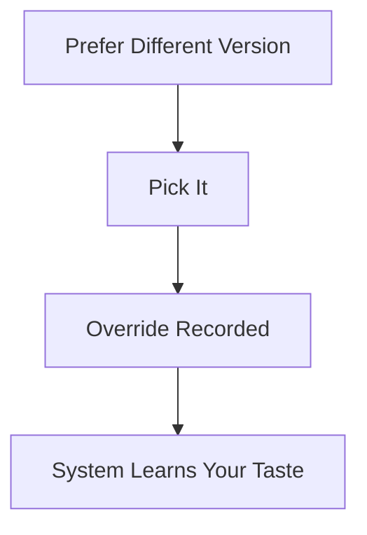
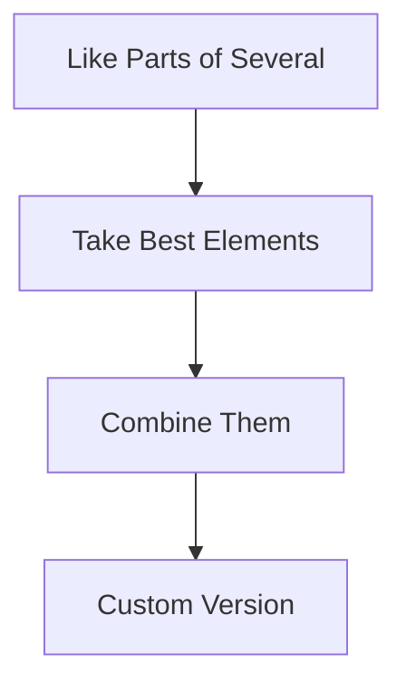
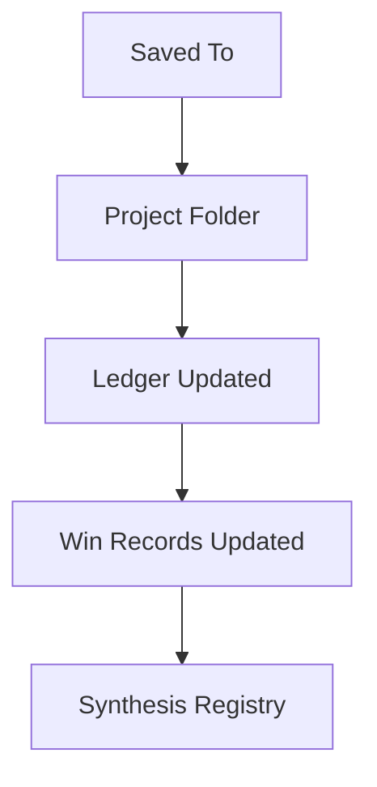

# What You Get

Understanding the outputs from an Arena run.

---

## Your Complete Output

---

## The 7 Webinar Versions

Each expert produces a complete webinar structure.

Each includes:
- Complete webinar structure
- Opening through close
- Specific frameworks used
- Why they made their choices

---

## The Rankings

| Rank | What It Means |
|------|---------------|
| 1st | Predicted marketplace winner |
| 2nd-3rd | Strong alternatives |
| 4th-7th | Different approaches that could work |

---

## The Score Breakdown

---

## Judge Reasoning

Not just a score - an explanation you can learn from.

---

## Learning Briefs

Each competitor receives feedback.

This is how the system learns and improves.

---

## How To Use Your Outputs

### Option 1: Use The Winner

### Option 2: Pick A Different One

### Option 3: Combine Elements

---

## Where Outputs Are Saved

Location: ~/.claude/webinar-arena/projects/

---

## Quick Reference

| Output | What It Contains |
|--------|------------------|
| 7 Versions | Complete webinar structures |
| Rankings | 1st through 7th with scores |
| Judge Reasoning | Why winner won |
| Learning Briefs | Feedback for each expert |
| Win Records | Historical performance data |

---

*Next: [[06-How-Judgment-Works]] - The scoring system explained*
