# How Judgment Works

The Marketplace Judge picks winners based on one question:

> "Which would generate the most revenue if presented to the same audience?"

---

## Not Methodology - Marketplace

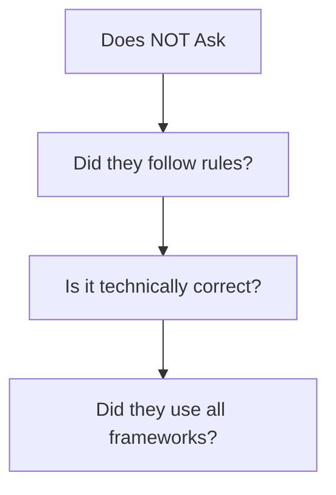

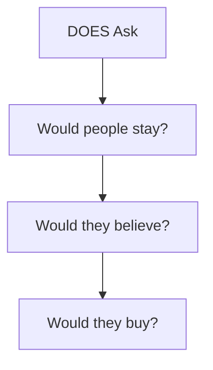

---

## The 7 Scoring Criteria

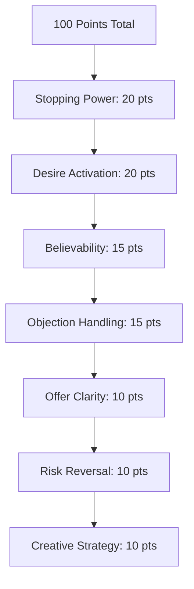

---

## Criterion 1: Stopping Power (20%)

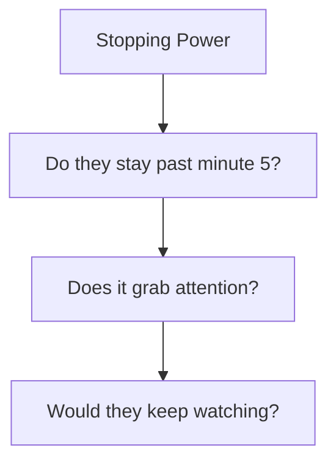

---

## Criterion 2: Desire Activation (20%)

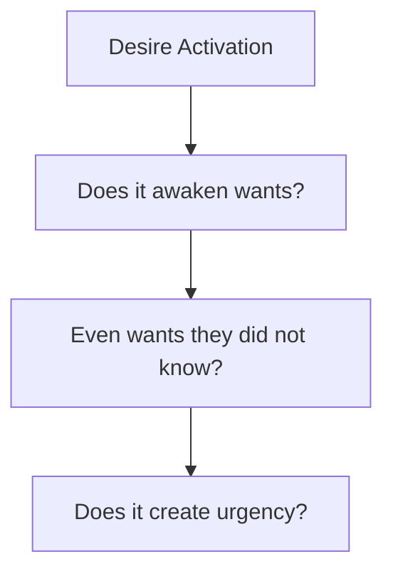

---

## Criterion 3: Believability (15%)

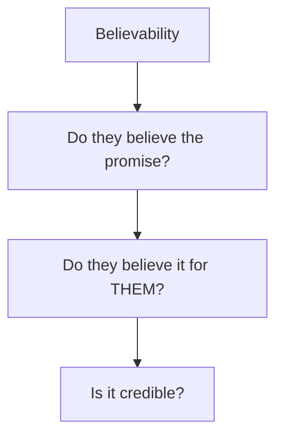

---

## Criterion 4: Objection Handling (15%)

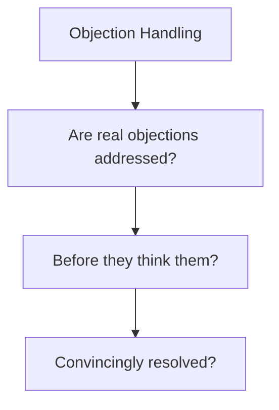

---

## Criterion 5: Offer Clarity (10%)

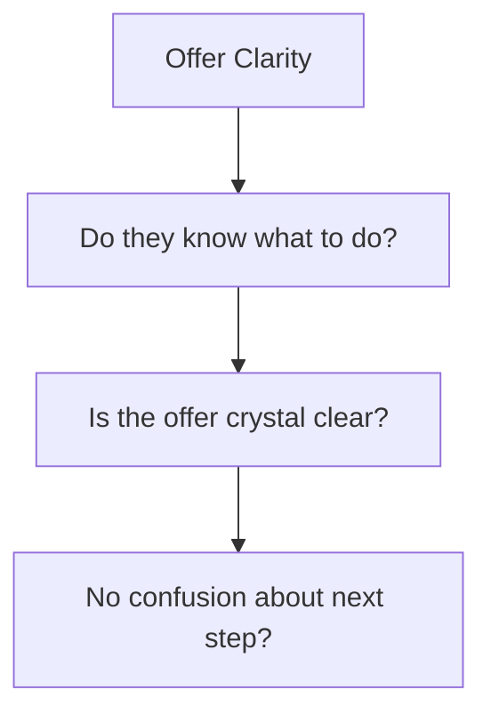

---

## Criterion 6: Risk Reversal (10%)

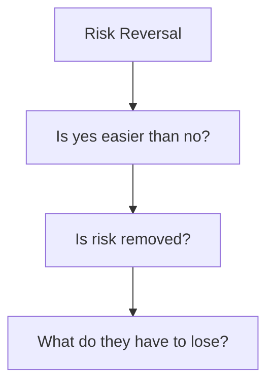

---

## Criterion 7: Creative Strategy (10%)

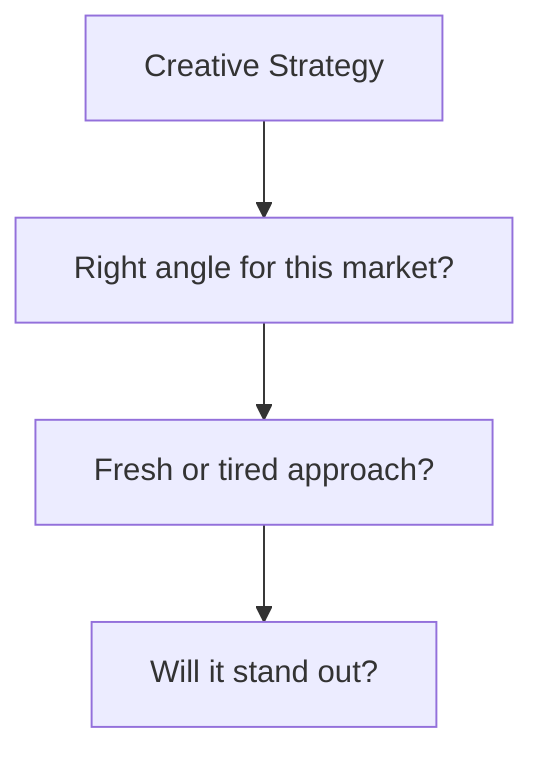

---

## Context Adjustments

Weights shift based on your brief.

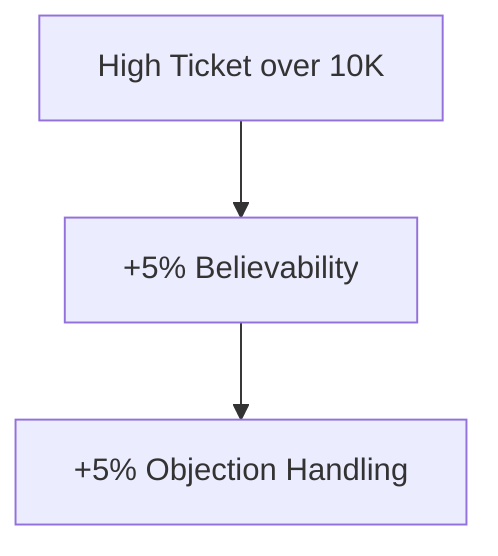

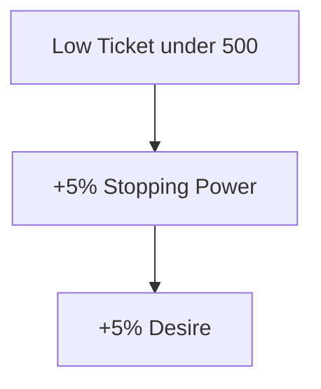

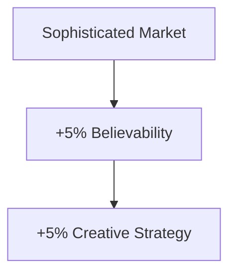

---

## You Can Override

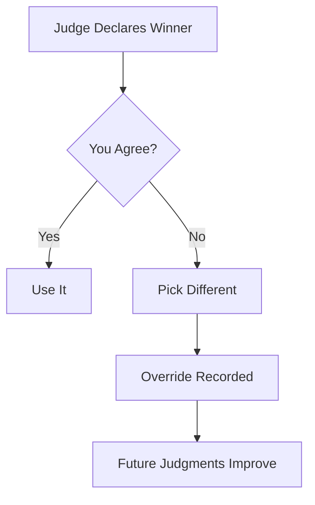

Your override helps calibrate the system.

---

## Weight Summary

| Criterion | Weight | What It Measures |
|-----------|--------|------------------|
| Stopping Power | 20% | Will they stay? |
| Desire Activation | 20% | Will they want it? |
| Believability | 15% | Will they believe it? |
| Objection Handling | 15% | Are concerns resolved? |
| Offer Clarity | 10% | Do they know what to do? |
| Risk Reversal | 10% | Is it safe to say yes? |
| Creative Strategy | 10% | Is the angle right? |

---

*Next: [[07-Evolution-And-Spawning]] - How the system improves*
