# Evolution And Spawning

The Arena gets smarter every time you use it.

---

## The Evolution Cycle

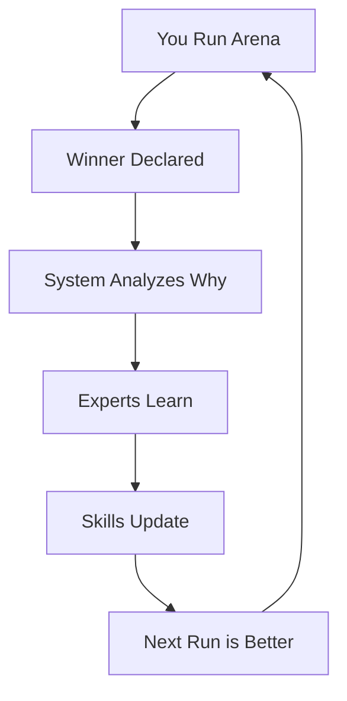

---

## What Gets Learned

After every competition:

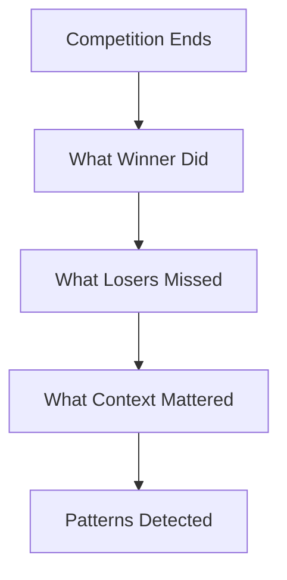

---

## How Skills Update

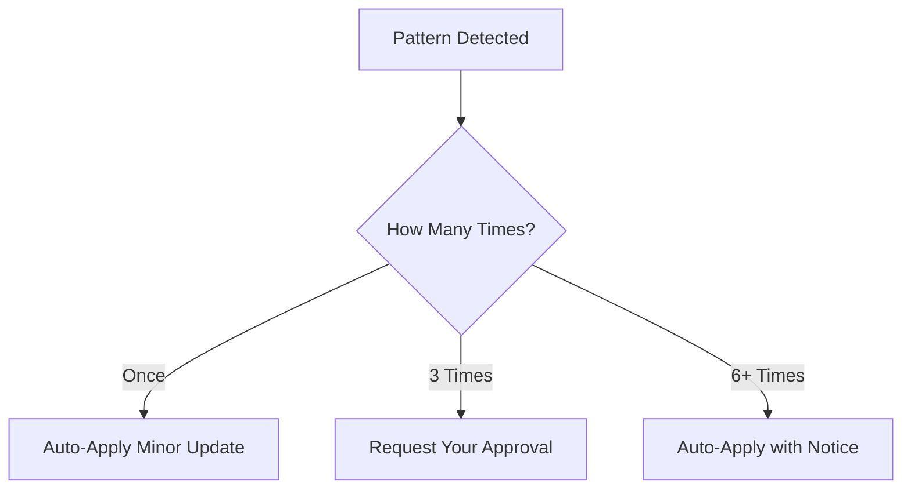

Minor patterns are applied automatically. Major changes ask first.

---

## Win Records Build Up

Each expert has a win record that grows over time.

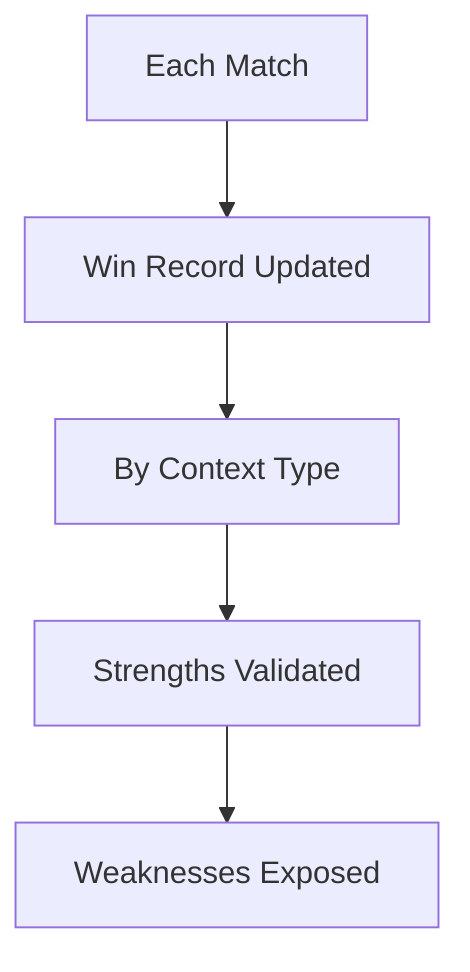

Over time, you learn which expert wins for which situations.

---

## The Learning Ledger

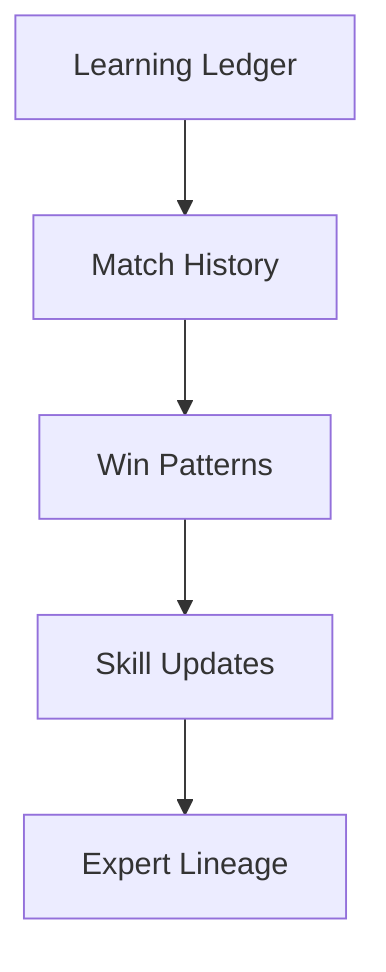

Everything is tracked at ~/.claude/webinar-arena/

---

## How Spawning Works

When Synthesis wins ALL rounds of a competition, something special happens.

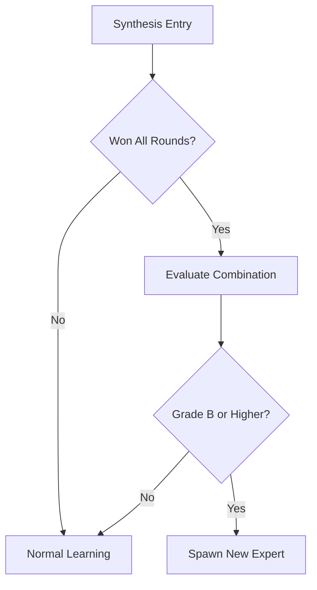

---

## What Gets Spawned

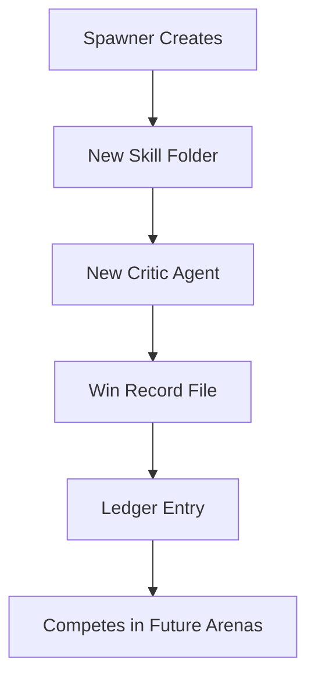

A winning synthesis combination becomes a permanent new expert.

---

## Spawning Example

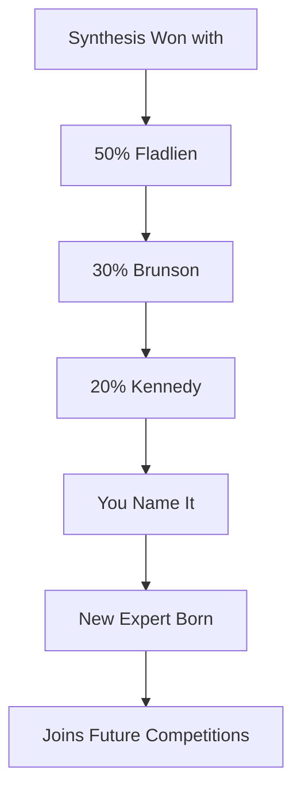

---

## Your System Evolves

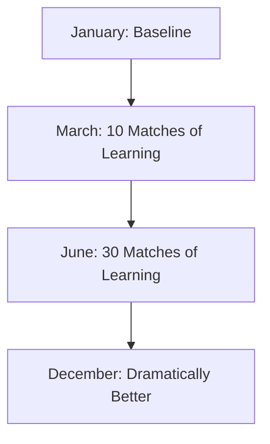

Every match makes every expert smarter.

---

## Why This Matters

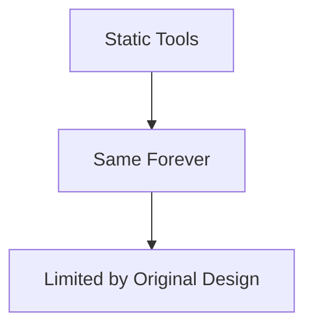

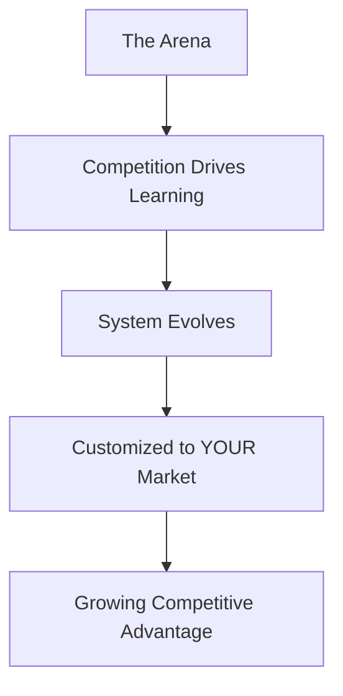

---

## Evolution Summary

| What | How It Works |
|------|--------------|
| Skills | Updated after patterns detected |
| Win Records | Track which expert wins when |
| Ledger | Logs all history and learning |
| Spawning | Creates new experts from winning synthesis |

---

*Next: [[08-Which-Expert-When]] - Picking the right approach*
