# Which Expert When

A visual guide to picking the right approach.

---

## Quick Decision: Price Point

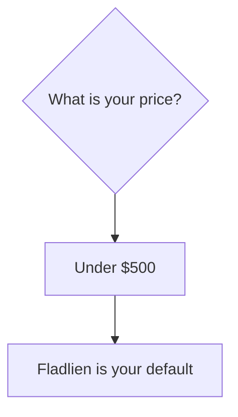

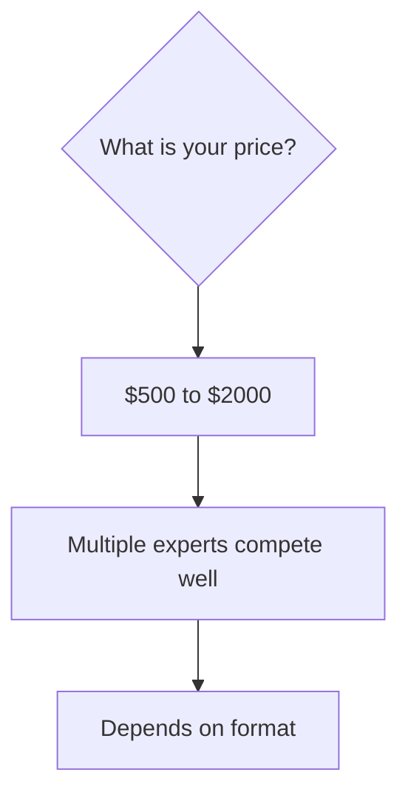

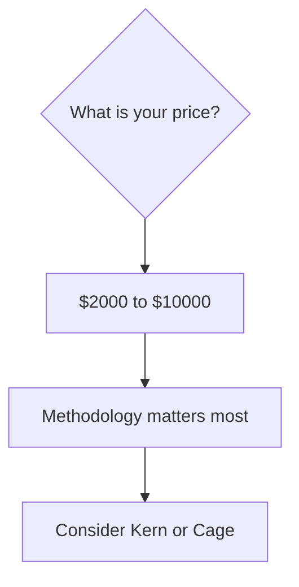

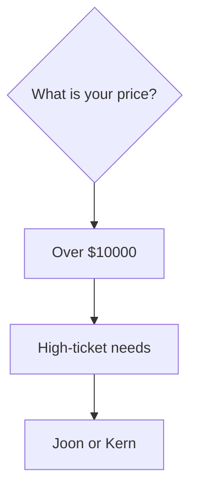

---

## Quick Decision: Format

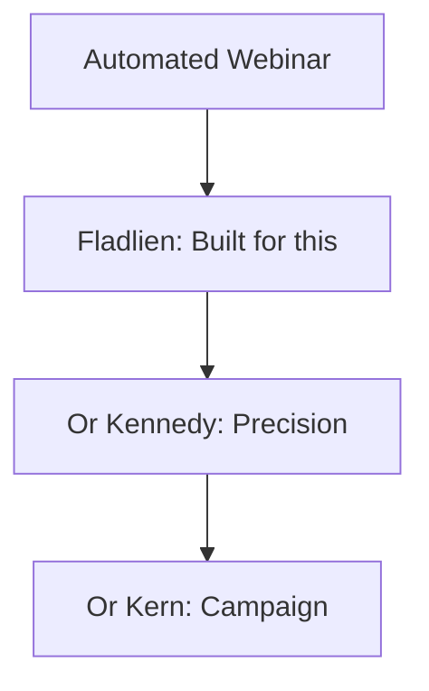

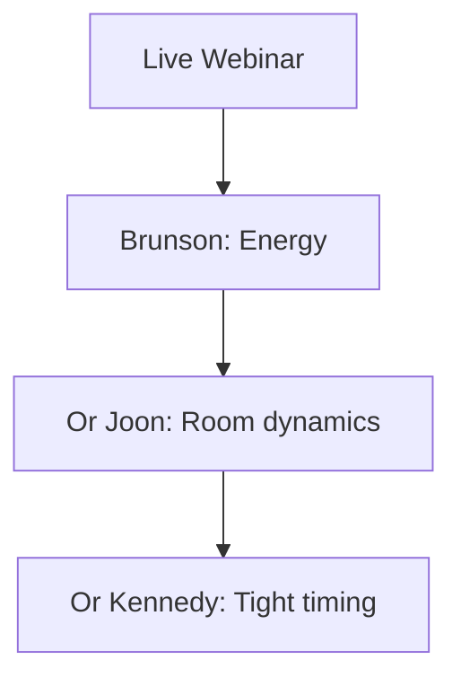

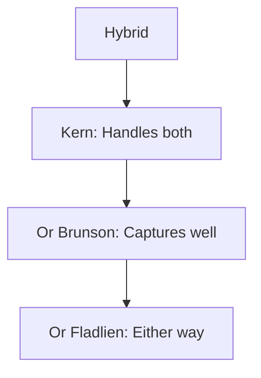

---

## Quick Decision: Audience

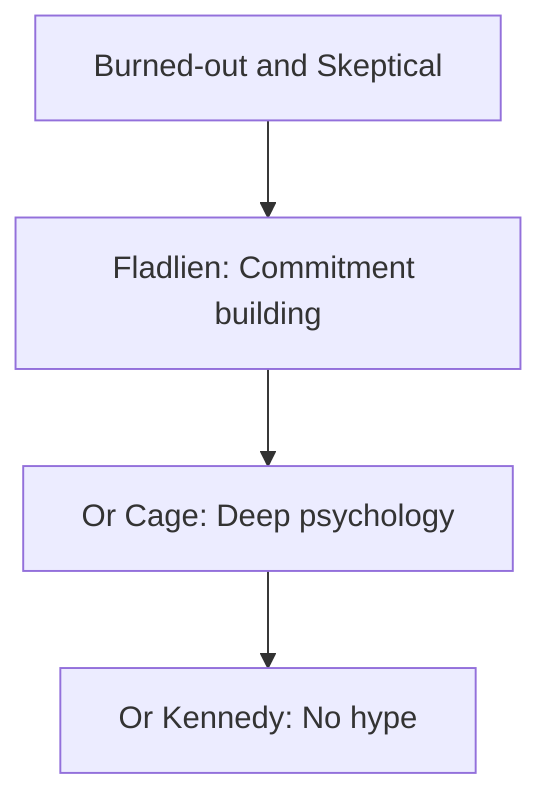

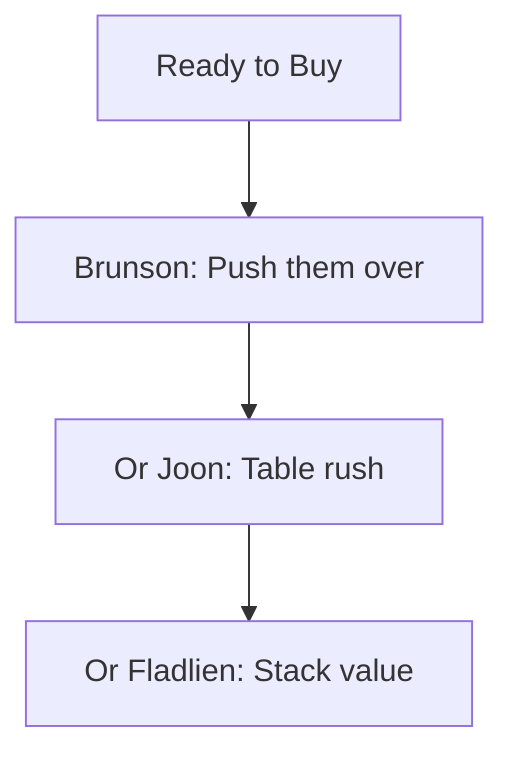

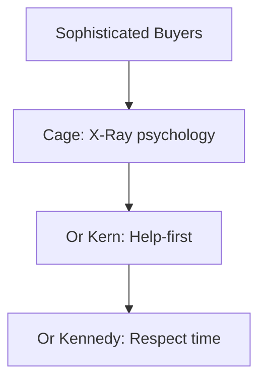

---

## Expert Sweet Spots

### Fladlien

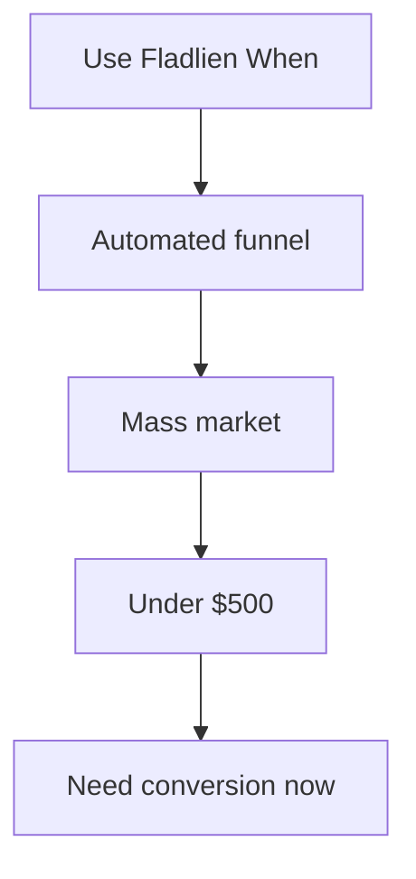

### Cage

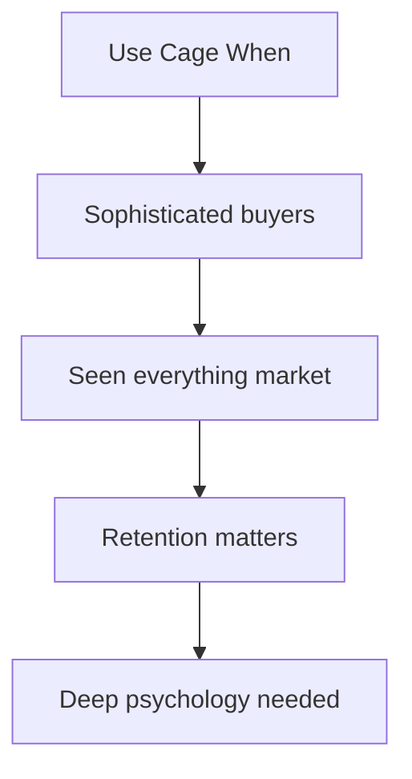

### Brunson

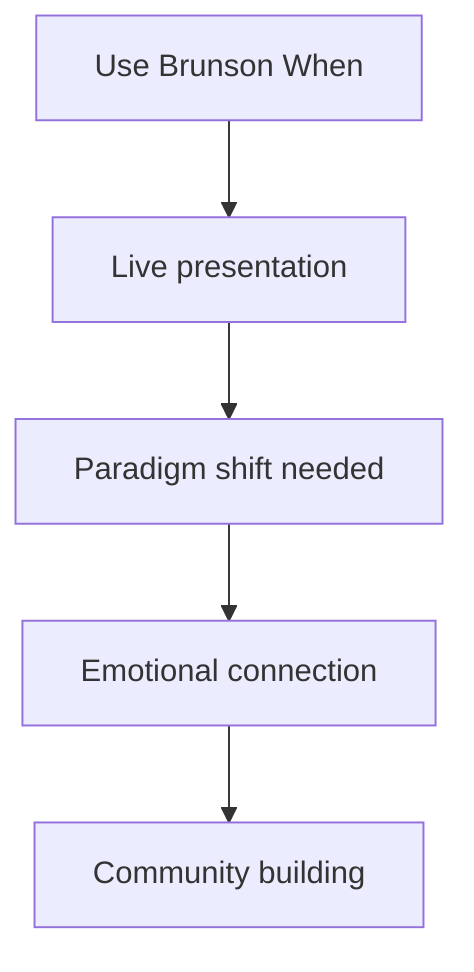

### Kern

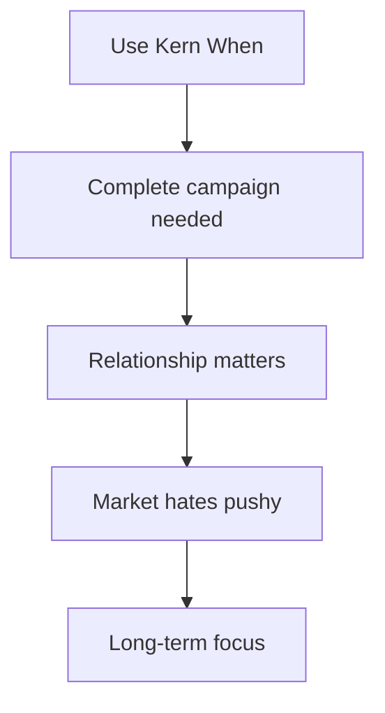

### Joon

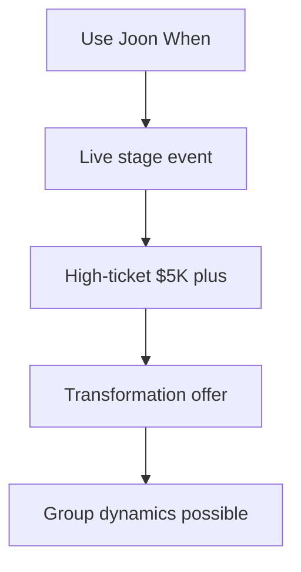

### Kennedy

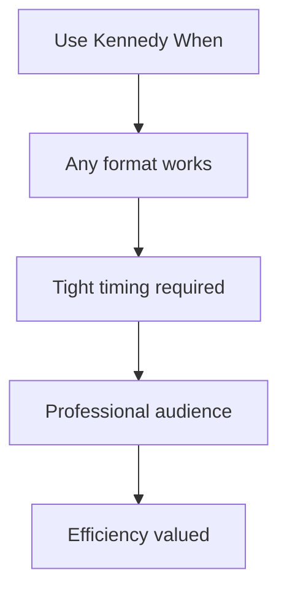

---

## When To Run The Arena

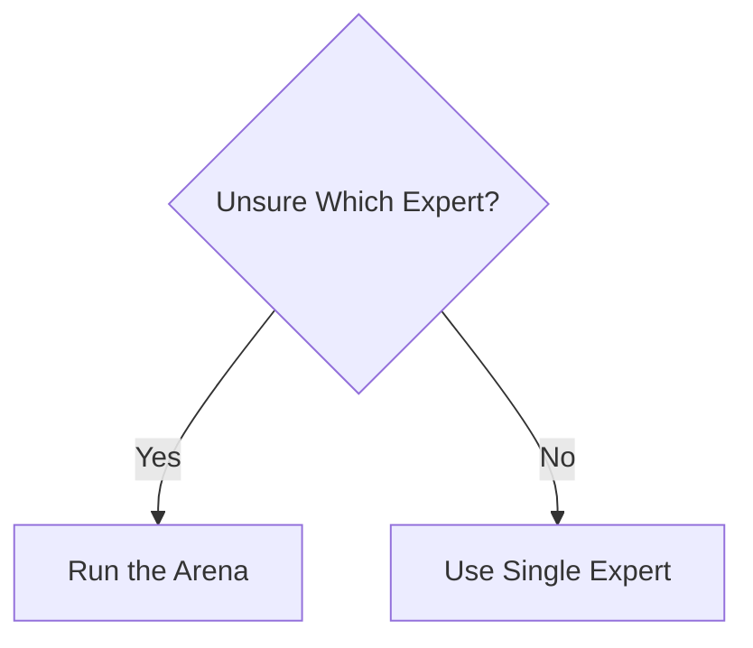

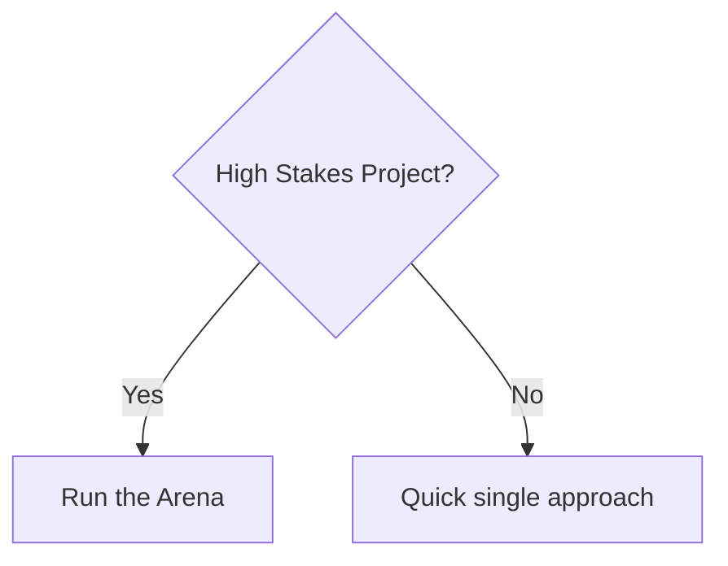

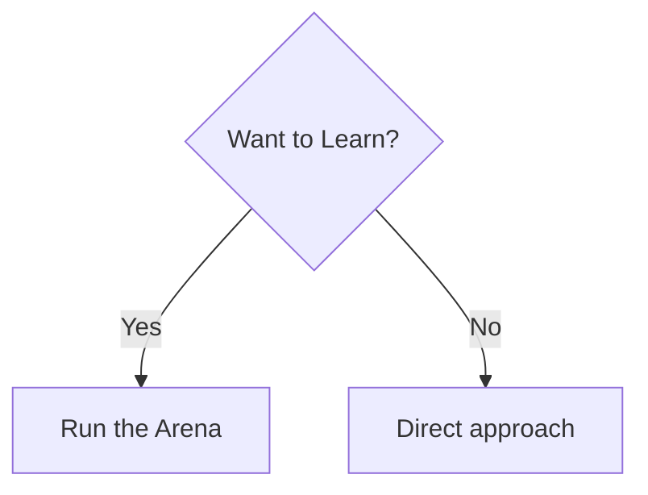

---

## Quick Reference Table

| Situation | Go-To Expert |
|-----------|--------------|
| Under $500, automated | Fladlien |
| Sophisticated, skeptical | Cage |
| Live, need energy | Brunson |
| Complete campaign | Kern |
| Live event, $5K+ | Joon |
| Any format, precision | Kennedy |
| Not sure | Run the Arena |

---

## The Arena Confirms Or Surprises

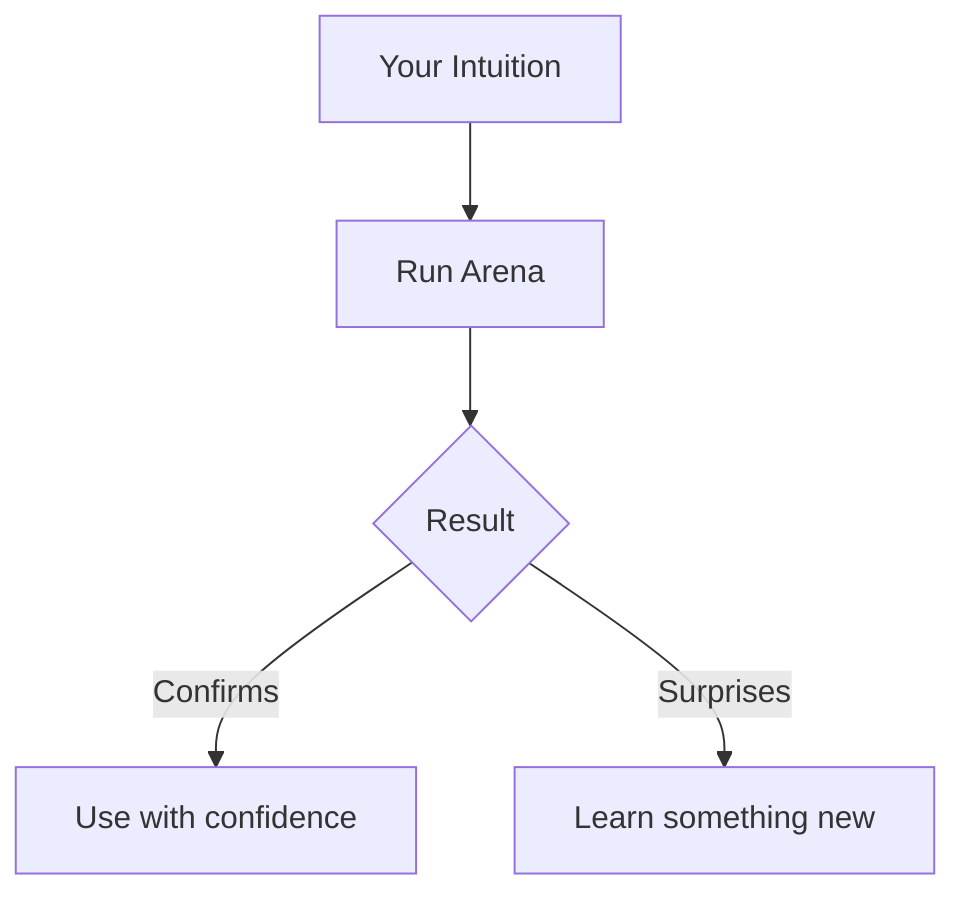

Either way, you win.

---

*Back to: [[00-Diagram-Index]] - All diagrams*
